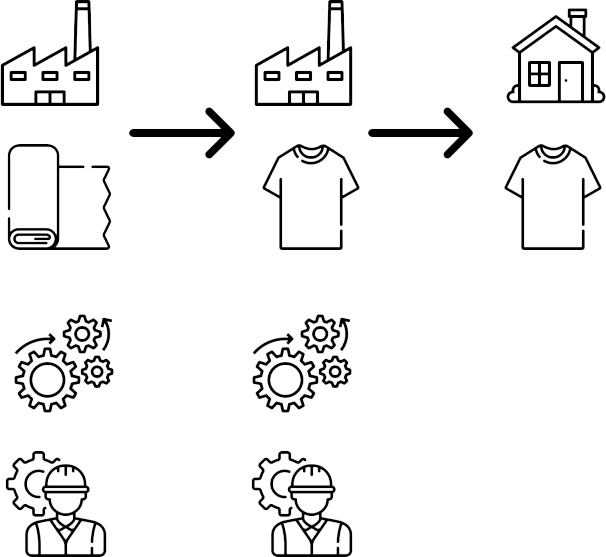
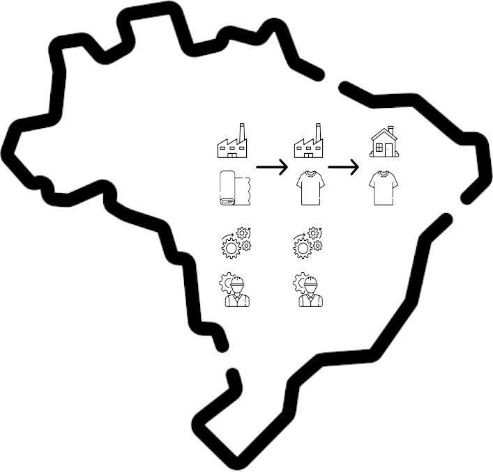
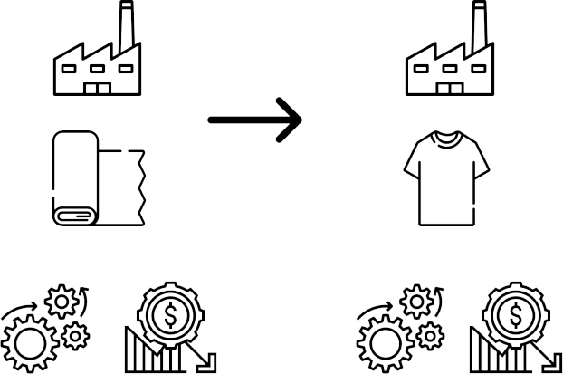
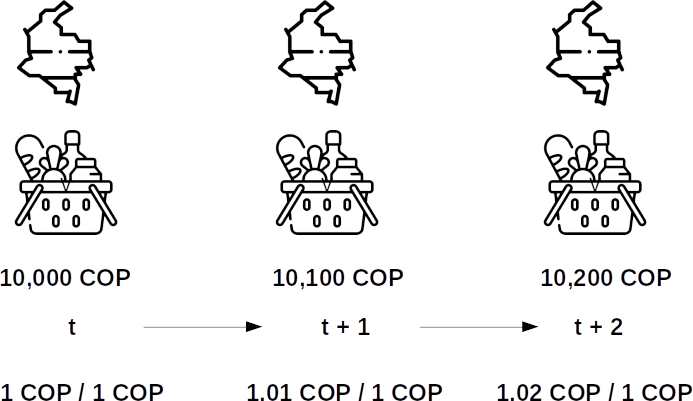
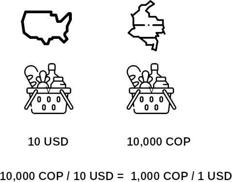

```{r}
#| label: libraries

library(tidyverse)
library(readxl)
library(gt)
library(wbstats)
library(scales)
```

```{r}
#| label: palette

umng_palette <- c(
  "#043074",
  "#fdc600",
  "#0d5e30",
  "#ee2a24",
  "#fc6700",
  "#00b3f0",
  "#6e3c1a",
  "#f8941c",
  "#8e44ad",
  "#2c3e50",
  "#16a085",
  "#c0392b"
)
```

# Please Read Me

##

-   Check the message **Welcome greeting** published in the News Bulletin Board.

-   Dear student please edit your profile uploading a photo where your face is clearly visible.

-   If you want to participate, please fill out the following survey: **Primer corte 30% > Learning Activities > Tu opinión sobre la economía colombiana**

-   This presentation is based on [@cardenas_introduccion_2020, Chapter 2]

## 

- **Purpose**

    - Understand how production is measured using the concept of Gross Domestic Product (GDP)

# Gross Domestic Product (GDP)

## {.smaller}

-   What is? [@lequiller_understanding_2014, p. 19]

    -   **Product**: means that we are trying to measure production without double counting

{.nostretch #fig-product width=45% fig-align="center"}

## {.smaller}

-   What is? [@lequiller_understanding_2014, p. 19]

    -   **Domestic**: means that the production to be taken into account is the one that is carried within a certain territory clearly delimited

{.nostretch #fig-domestic width=40% fig-align="center"}

## {.smaller}

-   What is? [@lequiller_understanding_2014, p. 19]

    -   **Gross**: means that depreciation is not deducted (in economy it is called consumption of fixed capital). In other words, the decrease in the value of the assets used in the production process due to physical deterioration, foreseeable wear or accidental damage is not deducted

{.nostretch #fig-gross width="45%" fig-align="center"}

## {.smaller} 

::: {.incremental}

-   How is measure?

    -   3 equivalent[^1] approaches are used [@lequiller_understanding_2014, p. 31]

        -   **Output/Production approach**: adding the aggregate value of all the production units in a territory, plus taxes minus subsidies on products

        -   **Income approach**: adding all the incomes that are perceived because of the contribution to the production process

        -   **Expenditure/Final demand approach**: adding all uses that firms, non-profit institutions, government bodies, households and the external sector give to production

    -   Gross Domestic Product is a flow so it is measured over a period of time. Usually you can find information about this variable in an monthly, quarterly or yearly periodicity

    -   Initially Gross Domestic Product is expressed in **current** Local Currency Units (LCU)

:::

[^1]: In practice, discrepancies may occur

##

```{r}
# Data
# https://www.dane.gov.co/ >
# Estadísticas por tema >
# Cuentas Nacionales >
# Cuentas Nacionales Coyunturales >
# PIB nacional trimestral (coyuntural) >
# Información técnica >
# Anexos estadísticos PIB producción >
# PIB a precios corrientes

# Import
gdp_agg_value <- read_excel("000_data/002_anexos_produccion_corrientes_I_2025.xlsx",
  sheet = 2,
  range = "C15:CF29",
  col_names = FALSE
)

# Tidy
gdp_agg_value_table <- gdp_agg_value |>
  # it is possible that data for the last quarter is not available
  # for the income approach select(1, ncol(gdp_agg_value - 1)) |>
  select(1, ncol(gdp_agg_value)) |>
  rename(concept = `...1`, value_last = `...82`)

## Helpers
last_update_gdp_agg_value <- ymd("2025-05-15")
last_row_gdp_agg_value <- nrow(gdp_agg_value_table)
first_row_gdp_agg_value <- floor(last_row_gdp_agg_value / 2)
```

```{r}
#| label: tbl-output-approach-1
#| tbl-cap: Output/Production approach I (Colombia, 2025-Q1)
#| html-table-processing: none

# Table
gdp_agg_value_table_clean_1 <- gdp_agg_value_table |>
  slice(1:first_row_gdp_agg_value) |>
  gt() |>
  fmt_number(
    columns = value_last,
    decimals = 0,
    sep_mark = ","
  ) |>
  cols_label(
    concept = "Concepto",
    value_last = "Miles de Millones - COP"
  ) |>
  cols_width(
    value_last ~ px(200)
  ) |>
  tab_footnote(
    footnote = "Preliminary data at current prices",
    locations = cells_column_labels(columns = value_last)
  ) |>
  tab_source_note(
    source_note = "Source: DANE - Cuentas Nacionales Trimestrales - Producto Interno Bruto desde el enfoque de la producción a precios corrientes - Cuadro 1 Datos originales"
  ) |>
  tab_source_note(
    source_note = str_glue("Last update: {last_update_gdp_agg_value}")
  ) |>
  tab_style(
    style = cell_text(weight = "bold"),
    locations = cells_column_labels()
  ) |>
  tab_options(
    row.striping.include_table_body = TRUE,
    table.border.top.width = px(3),
    table.border.top.color = "black",
    column_labels.border.bottom.width = px(2),
    column_labels.border.bottom.color = "black",
    table.border.bottom.width = px(3),
    table.border.bottom.color = "black",
    table.font.size = px(18),
    footnotes.marks = "letters"
  )

gdp_agg_value_table_clean_1
```

##

```{r}
#| label: tbl-output-approach-2
#| tbl-cap: Output/Production approach II (Colombia, 2025-Q1)
#| html-table-processing: none

# Table
gdp_agg_value_table_clean_2 <- gdp_agg_value_table |>
  slice((first_row_gdp_agg_value + 1):last_row_gdp_agg_value) |>
  gt() |>
  fmt_number(
    columns = value_last,
    decimals = 0,
    sep_mark = ","
  ) |>
  cols_label(
    concept = "Concepto",
    value_last = "Miles de Millones - COP"
  ) |>
  cols_width(
    value_last ~ px(200)
  ) |>
  tab_footnote(
    footnote = "Preliminary data at current prices",
    locations = cells_column_labels(columns = value_last)
  ) |>
  tab_source_note(
    source_note = "Source: DANE - Cuentas Nacionales Trimestrales - Producto Interno Bruto desde el enfoque de la producción a precios corrientes - Cuadro 1 Datos originales"
  ) |>
  tab_source_note(
    source_note = str_glue("Last update: {last_update_gdp_agg_value}")
  ) |>
  tab_style(
    style = cell_text(weight = "bold"),
    locations = cells_column_labels()
  ) |>
  tab_style(
    style = cell_fill(color = "#fdc600"),
    locations = cells_body(rows = 6)
  ) |>
  tab_style(
    style = cell_fill(color = "#ee2a24"),
    locations = cells_body(rows = 7)
  ) |>
  tab_style(
    style = cell_fill(color = "#00b3f0"),
    locations = cells_body(rows = 8)
  ) |>
  tab_options(
    row.striping.include_table_body = TRUE,
    table.border.top.width = px(3),
    table.border.top.color = "black",
    column_labels.border.bottom.width = px(2),
    column_labels.border.bottom.color = "black",
    table.border.bottom.width = px(3),
    table.border.bottom.color = "black",
    table.font.size = px(18),
    footnotes.marks = "letters"
  )

gdp_agg_value_table_clean_2
```

##

```{r}
# Data
# https://www.dane.gov.co/ >
# Estadísticas por tema >
# Cuentas Nacionales >
# Cuentas Nacionales Coyunturales >
# PIB nacional trimestral (coyuntural) >
# Información técnica >
# Anexos estadísticos PIB enfoque ingreso >
# PIB a precios corrientes

# Import
gdp_income <- read_excel("000_data/002_anexos_ingreso_corrientes_I_2025.xlsx",
  sheet = 2,
  range = "C14:AO42",
  col_names = FALSE
)

# Tidy
gdp_income_table <- gdp_income |>
  select(1, ncol(gdp_income)) |>
  rename(concept = `...1`, value_last = `...39`) |>
  slice(1:3, 16, 29)

## Helpers
last_update_gdp_income <- ymd("2025-06-27")
```

```{r}
#| label: tbl-income-approach
#| tbl-cap: Income approach (Colombia, 2025-Q1)
#| html-table-processing: none

# Table
gdp_income_table_clean <- gdp_income_table |>
  gt() |>
  fmt_number(
    columns = value_last,
    decimals = 0,
    sep_mark = ","
  ) |>
  cols_label(
    concept = "Concepto",
    value_last = "Miles de Millones - COP"
  ) |>
  tab_footnote(
    footnote = "Preliminary data at current prices",
    locations = cells_column_labels(columns = value_last)
  ) |>
  tab_source_note(
    source_note = "Source: DANE - Cuentas Nacionales Trimestrales - PIB por Ingreso - S1 Total Economía"
  ) |>
  tab_source_note(source_note = str_glue("Last update: {last_update_gdp_income}")) |>
  tab_style(
    style = cell_text(weight = "bold"),
    locations = cells_column_labels()
  ) |>
  tab_style(
    style = cell_fill(color = "#ee2a24"),
    locations = cells_body(rows = 2)
  ) |>
  tab_style(
    style = cell_fill(color = "#00b3f0"),
    locations = cells_body(rows = 5)
  ) |>
  tab_options(
    row.striping.include_table_body = TRUE,
    table.border.top.width = px(3),
    table.border.top.color = "black",
    column_labels.border.bottom.width = px(2),
    column_labels.border.bottom.color = "black",
    table.border.bottom.width = px(3),
    table.border.bottom.color = "black",
    table.font.size = px(20),
    footnotes.marks = "letters"
  )

gdp_income_table_clean
```

##

```{r}
# Data
# https://www.dane.gov.co/ >
# Estadísticas por tema >
# Cuentas Nacionales >
# PIB nacional trimestral (coyuntural) >
# Información técnica >
# Anexos estadísticos PIB gasto >
# PIB a precios corrientes

# Import
gdp_expenditure <- read_excel("000_data/002_anexos_gasto_corrientes_I_2025.xlsx",
  sheet = 2,
  range = "B15:CE21",
  col_names = FALSE
)

# Tidy
gdp_expenditure_table <- gdp_expenditure |>
  # it is possible that data for the last quarter is not available for the income approach
  # select(1, ncol(gdp_expenditure)-1) |>
  select(1, ncol(gdp_expenditure)) |>
  slice(1:3, 5:7) |>
  rename(concept = `...1`, value_last = `...82`) |>
  mutate(concept = replace(
    concept,
    concept == "Gasto de consumo final individual de los hogares; gasto de consumo final de las ISFLH2",
    "Gasto de consumo final individual de los hogares y las ISFLH"
  ))

## Helpers
last_update_gdp_expenditure <- ymd("2025-05-15")
```

```{r}
#| label: tbl-expenditure-approach
#| tbl-cap: Expenditure/Final demand approach (Colombia, 2025-Q1)
#| html-table-processing: none

# Table
gdp_expenditure_table_clean <- gdp_expenditure_table |>
  gt() |>
  fmt_number(
    columns = value_last,
    decimals = 0,
    sep_mark = ","
  ) |>
  cols_label(
    concept = "Concepto",
    value_last = "Miles de Millones - COP"
  ) |>
  tab_footnote(
    footnote = "Preliminary data at current prices",
    locations = cells_column_labels(columns = value_last)
  ) |>
  tab_footnote(
    footnote = "Instituciones sin fines de lucro que sirven a los hogares",
    locations = cells_body(columns = concept, rows = 1)
  ) |>
  tab_source_note(
    source_note = "Source: DANE - Cuentas Nacionales Trimestrales - PIB por Ingreso - S1 Total Economía"
  ) |>
  tab_source_note(source_note = str_glue("Last update: {last_update_gdp_expenditure}")) |>
  tab_style(
    style = cell_text(weight = "bold"),
    locations = cells_column_labels()
  ) |>
  tab_style(
    style = cell_fill(color = "#fc6700"),
    locations = cells_body(rows = 5)
  ) |>
  tab_style(
    style = cell_fill(color = "#ee2a24"),
    locations = cells_body(rows = 6)
  ) |>
  tab_options(
    row.striping.include_table_body = TRUE,
    table.border.top.width = px(3),
    table.border.top.color = "black",
    column_labels.border.bottom.width = px(2),
    column_labels.border.bottom.color = "black",
    table.border.bottom.width = px(3),
    table.border.bottom.color = "black",
    table.font.size = px(20),
    footnotes.marks = "letters"
  )

gdp_expenditure_table_clean
```

## {.smaller}

-   What adjustments are applied?[^2]

    -   **Inflation adjustments**

        -   GDP is expressed in **constant** Local Currency Units (LCU)

    -   **Season and calendar adjustments**

        -   In Colombia this is applied to quarterly GDP [@dane_cuentas_2018]

    -   **Population adjustments**

        -   GDP is expressed in per capita terms

    -   **Purchase Power Parity (PPP) adjustment**

        -   It is used only to make international comparisons and it is led by the International Comparison Program (ICP)

[^2]: For an introduction of the first 3 adjustments check out [@hyndman_forecasting_2021, Chapter 3, Section 3.1 Transformations and adjustments]

## {.smaller}

- An inflation adjustment is necessary because an arbitrary quantity of local currency units don't have the same purchase power in different periods

{.nostretch #fig-inflation-adjustment width=60% fig-align="center"}

##

```{r}
# Import
gdp_nominal_real_col <- wb_data(
  country = c("COL"),
  indicator = c("NY.GDP.MKTP.CN", "NY.GDP.MKTP.KN"),
  return_wide = FALSE
)
```

```{r}
#| label: fig-nominal-real-gdp-col
#| fig-cap: Nominal and real GDP Colombia

# Visualization
gdp_nominal_real_col |>
  select(country, date, value, indicator) |>
  ggplot(aes(
    x = date,
    y = value
  )) +
  geom_point(aes(fill = indicator), 
             color = "black", 
             shape = 21, 
             show.legend = FALSE) +
  geom_line(aes(
    color = indicator,
    group = indicator
  )) +
  geom_vline(
    xintercept = 2015,
    color = umng_palette[1]
  ) +
  labs(
    x = "Year",
    y = "Billions (Long scale: 10^12)",
    color = NULL,
    subtitle = str_glue("Nominal GDP code WDI: NY.GDP.MKTP.CN
                            Nominal GDP units: current LCU
                            Real GDP code WDI: NY.GDP.MKTP.KN
                            Real GDP units: constant LCU Base Year 2015"),
    caption = str_glue("Source: World Development Indicators (WDI) - World Bank
                             Last update date: {unique(gdp_nominal_real_col$last_updated)}")
  ) +
  scale_x_continuous(breaks = c(
    seq.int(from = 1960, to = 2000, by = 20),
    2015,
    max(gdp_nominal_real_col$date)
  )) +
  scale_y_continuous(labels = label_number(
    scale = 1e-12,
    suffix = "B"
  )) +
  scale_color_manual(values = umng_palette[1:2]) +
  scale_fill_manual(values = umng_palette[1:2]) +
  theme(
    panel.border = element_rect(
      fill = NA,
      color = "black"
    ),
    plot.background = element_rect(fill = "white"),
    panel.background = element_rect(fill = "white"),
    legend.background = element_rect(fill = "white"),
    axis.text = element_text(size = 10),
    legend.position = "bottom"
  )
```

## {.smaller}

-   Purchasing power parity

    -   The amount of products that 1 local currency unit of an economy can buy in another economy

{.nostretch #fig-purchasing-power-parity-adjustment width="50%" fig-align="center"}

##

```{r}
# Import
gdp_per_capita_ppp_col_usa <- wb_data(
  country = c("COL", "USA"),
  # Only data for 1990 onwards
  start_date = 1990,
  end_date = 2024,
  indicator = c("NY.GDP.PCAP.PP.KD")
)
```

```{r}
#| label: fig-real-gdp-pc-ppp-col-usa
#| fig-cap: GDP per-capita purchasing power parity for Colombia and USA

# Visualization
gdp_per_capita_ppp_col_usa |>
  select(country, date, NY.GDP.PCAP.PP.KD) |>
  ggplot(aes(
    x = date,
    y = NY.GDP.PCAP.PP.KD
  )) +
  geom_point(aes(fill = country),
    color = "black", shape = 21,
    show.legend = FALSE
  ) +
  geom_line(aes(
    color = country,
    group = country
  )) +
  geom_vline(
    xintercept = 2021,
    color = umng_palette[1]
  ) +
  scale_color_manual(values = umng_palette[1:2]) +
  scale_fill_manual(values = umng_palette[1:2]) +
  expand_limits(y = 0) +
  scale_x_continuous(breaks = c(
    seq.int(from = 1990, to = 2010, by = 10),
    2021,
    max(gdp_per_capita_ppp_col_usa$date)
  )) +
  labs(
    x = "Year",
    y = "Thousands",
    color = NULL,
    subtitle = str_glue("Variable code WDI: NY.GDP.PCAP.PP.KD
                             Variable units: constant 2021 international USD"),
    caption = str_glue("Source: World Development Indicators (WDI) - World Bank
                             Last update date: {unique(gdp_per_capita_ppp_col_usa$last_updated)}")
  ) +
  scale_y_continuous(labels = number_format(
    scale = 1e-3,
    suffix = "K",
    accuracy = 1
  )) +
  theme(
    panel.border = element_rect(fill = NA, color = "black"),
    plot.background = element_rect(fill = "#f3fcfc"),
    panel.background = element_rect(fill = "#f3f7fc"),
    legend.background = element_rect(fill = "#f3fcfc"),
    legend.position = "bottom",
    plot.title = element_text(face = "bold"),
    axis.title = element_text(face = "bold"),
    legend.title = element_text(face = "bold"),
    axis.text = element_text(face = "bold"),
    axis.text.x = element_text(size = 12),
    axis.text.y = element_text(size = 12)
  ) +
  theme(
    panel.border = element_rect(
      fill = NA,
      color = "black"
    ),
    plot.background = element_rect(fill = "white"),
    panel.background = element_rect(fill = "white"),
    legend.background = element_rect(fill = "white"),
    axis.text = element_text(size = 10),
    legend.position = "bottom"
  )
```

# Economic Growth

## {.smaller} 

-   The most common metric used to measure economic growth is the annual percent growth of real GDP per capita.

    -   If the periodicity of real GDP per capita is **yearly** and we don't want to make international comparisons the formula is:

$$\frac{\text{GDP per capita constant LCU}_t - \text{GDP per capita constant LCU}_{t-1}}{\text{GDP per capita constant LCU}_{t-1}} \times 100$$

##

```{r}
# Import
growth_real_gpd_per_capita_col <- wb_data(
  country = c("COL"),
  indicator = c("NY.GDP.PCAP.KD.ZG")
)
```

```{r}
#| label: fig-growth-real-gdp-pc-col-usa
#| fig-cap: Growth real GDP per-capita Colombia

# Visualization
growth_real_gpd_per_capita_col |>
  select(country, date, NY.GDP.PCAP.KD.ZG) |>
  # We don't have data for the year 1960
  filter(!is.na(NY.GDP.PCAP.KD.ZG)) |>
  ggplot(aes(
    x = date,
    y = NY.GDP.PCAP.KD.ZG
  )) +
  geom_hline(
    yintercept = 0,
    color = umng_palette[3],
    linewidth = 1,
    linetype = "twodash"
  ) +
  geom_line(color = umng_palette[1]) +
  geom_point(
    color = "black",
    fill = umng_palette[2],
    shape = 21
  ) +
  labs(
    x = "Year",
    y = "Percent",
    subtitle = str_glue("Variable code WDI: NY.GDP.PCAP.KD.ZG
                             Variable units: annual percent using constant LCU Base Year 2015"),
    caption = str_glue("Source: World Development Indicators (WDI) - World Bank
                             Last update date: {unique(growth_real_gpd_per_capita_col$last_updated)}")
  ) +
  scale_x_continuous(breaks = c(
    1961,
    seq.int(from = 1980, to = 2020, by = 20),
    max(growth_real_gpd_per_capita_col$date)
  )) +
  scale_y_continuous(labels = label_number(suffix = "%")) +
  theme(
    panel.border = element_rect(
      fill = NA,
      color = "black"
    ),
    plot.background = element_rect(fill = "white"),
    panel.background = element_rect(fill = "white"),
    legend.background = element_rect(fill = "white"),
    axis.text = element_text(size = 10)
  )
```

# Acknowledgments

## 

-   To my family that supports me

-   To the taxpayers of Colombia and the [**UMNG students**](https://www.umng.edu.co/estudiante) who pay my salary

-   To the [**Business Science**](https://www.business-science.io/) and [**R4DS Online Learning**](https://www.rfordatasci.com/) communities where I learn [**R**](https://www.r-project.org/about.html) and [**$\pi$-thon**](https://www.python.org/about/)

-   To the [**R Core Team**](https://www.r-project.org/contributors.html), the creators of [**RStudio IDE**](https://posit.co/download/rstudio-desktop/), [**Positron**](https://positron.posit.co/), [**Quarto**](https://quarto.org/) and the authors and maintainers of the packages [**tidyverse**](https://CRAN.R-project.org/package=tidyverse),
[**readxl**](https://CRAN.R-project.org/package=readxl),
[**gt**](https://CRAN.R-project.org/package=gt),
[**wbstats**](https://CRAN.R-project.org/package=wbstats), and [**tinytex**](https://CRAN.R-project.org/package=tinytex) for allowing me to access these tools without paying for a license

##

-   To the icon designers [**Brecris**](https://www.flaticon.com/authors/becris), [**Freepik**](https://www.flaticon.com/authors/freepik), [**Iconixar**](https://www.flaticon.com/authors/iconixar), [**Monkik**](https://www.flaticon.com/authors/monkik) and [**Eucalyp**](https://www.flaticon.com/authors/eucalyp) from [**Flaticon**](https://www.flaticon.com/) for letting me use their work in this presentation as a free user
    
# References {.allowframebreaks}
