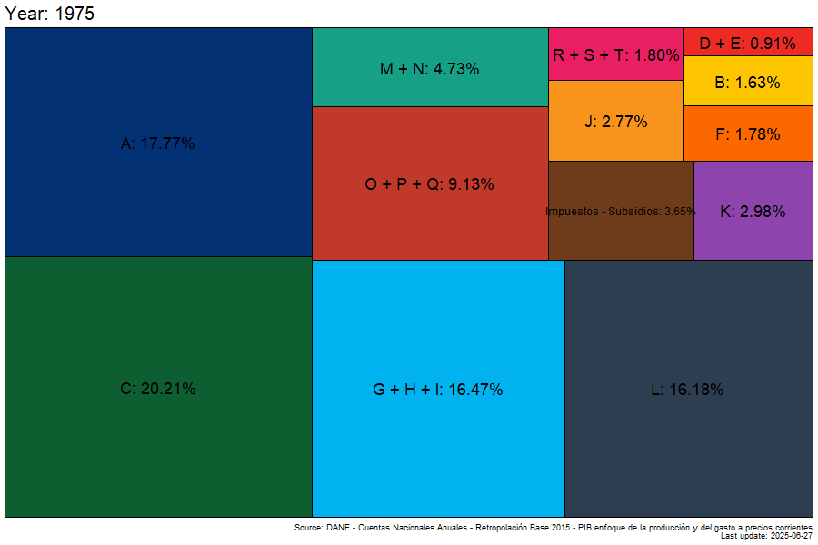

```{r}
#| label: libraries

library(tidyverse)
library(readxl)
library(gt)
library(wbstats)
library(scales)
# See 000_gifs/002_gdp_sector_plot_anim.R
## library(treemapify)
## library(gganimate)
```

```{r}
#| label: palette

umng_palette <- c(
  "#043074",
  "#fdc600",
  "#0d5e30",
  "#ee2a24",
  "#fc6700",
  "#00b3f0",
  "#6e3c1a",
  "#f8941c",
  "#8e44ad",
  "#2c3e50",
  "#16a085",
  "#c0392b",
  "#e91e63"
)
```

# Please Read Me

##

-   Check the message **Welcome greeting** published in the News Bulletin Board.

-   Dear student please edit your profile uploading a photo where your face is clearly visible.

-   If you want to participate, please fill out the following survey: **Primer corte 30% > Learning Activities > Tu opinión sobre la economía colombiana**

-   This presentation is based on [@cardenas_introduccion_2020, Chapter 2]

## 

- **Purpose**

    - Understand how production is measured using the concept of Gross Domestic Product (GDP)
    
# Inflation adjustments in GPD

## {.smaller}

-   Initially the Gross Domestic Product is expressed in current Local Currency Units (LCU) which is the sum of monetary values

-   A particular monetary value is the product of a quantity and a unit price

-   A change in the level of Gross Domestic Product, measure in current LCU, is a combination of changes in quantities and prices

    -   Inflation adjustments, applied to GDP, **try** to eliminate the changes of prices

    -   There are 2 approaches to make inflation adjustments [@abs_demystifying_2003]:

        -   **Constant price estimates**
        -   **Chain volume measures**

## {.smaller}

-   **Chain volume measures** is the alternative used by the Departamento Administrativo Nacional de Estadística (DANE) to make inflation adjustments

    -   A gentle introduction to this approach is explained in [@abs_demystifying_2003]

    -   The monetary values adjusted using **chain volume measures** are not additive. This means that the sum of the components of an aggregate is not necessarily equal to the aggregate

        -   In addition to the values adjusted using **chain volume measures**, DANE reports a value known as statistical discrepancy because of non additivity

##

```{r}
# Data
# Estadísticas por tema >
# Cuentas Nacionales >
# Cuentas Nacionales Anuales >
# Cuentas nacionales anuales >
# Principales agregados macroeconómicos >
# Principales agregados macroeconómicos 2005-2024pr

# Import
gdp_expenditure_annual <- read_excel("000_data/002_agregados_macroeconomicos_cuentas_nal_anuales_2005_2023p_2024pr.xlsx",
  sheet = 3,
  range = "E129:Y146",
  col_names = FALSE,
  trim_ws = TRUE
)

# Tidy
gdp_expenditure_annual_table <- gdp_expenditure_annual |>
  select(1, 12, ncol(gdp_expenditure_annual) - 1, ncol(gdp_expenditure_annual)) |>
  slice(1:4, 6, 15:18) |>
  # The values of the columns are characters
  mutate(across(.cols = 2:4, .fns = as.numeric)) |>
  rename(
    concept = `...1`, value_2015 = `...12`,
    value_2023 = `...20`,
    value_2024 = `...21`
  ) |>
  mutate(concept = case_when(
    concept == "Gasto de consumo final individual de los hogares; gasto de consumo final de las ISFLH1" ~ "Gasto de consumo final individual de los hogares y las ISFLH",
    TRUE ~ concept
  ))

## Helpers
last_update_gdp_expenditure_annual <- ymd("2025-06-27")
```

```{r}
#| label: tbl-expenditure-approach-chain-volume
#| tbl-cap: Expenditure/Final demand approach using chain volume measures and expressed in thousands of millions (Colombia)
#| html-table-processing: none

# Table
gdp_expenditure_annual_table_clean <- gdp_expenditure_annual_table |>
  gt() |>
  fmt_number(
    columns = -concept,
    decimals = 0,
    sep_mark = ","
  ) |>
  cols_label(
    concept = "Concepto",
    value_2015 = "2015",
    value_2023 = "2023",
    value_2024 = "2024"
  ) |>
  tab_footnote(
    footnote = "Provisional data",
    locations = cells_column_labels(columns = 3)
  ) |>
  tab_footnote(
    footnote = "Preliminary data",
    locations = cells_column_labels(columns = 4)
  ) |>
  tab_footnote(
    footnote = "Instituciones sin fines de lucro que sirven a los hogares",
    locations = cells_body(
      columns = 1,
      rows = c(1, 3)
    )
  ) |>
  tab_source_note(
    source_note = "Source: DANE - Cuentas Nacionales Anuales - Producto Interno Bruto (PIB) - Series encadenadas de volumen con año de referencia 2015"
  ) |>
  tab_source_note(
    source_note = str_glue("Last update: {last_update_gdp_expenditure_annual}")
  ) |>
  tab_style(
    style = cell_text(weight = "bold"),
    locations = cells_column_labels()
  ) |>
  tab_style(
    style = cell_fill(color = umng_palette[11]),
    locations = cells_body(rows = c(1, 4:6))
  ) |>
  tab_style(
    style = cell_text(indent = px(20)),
    locations = cells_body(rows = 2:3)
  ) |>
  tab_style(
    style = cell_fill(color = umng_palette[5]),
    locations = cells_body(rows = 7)
  ) |>
  tab_style(
    style = cell_fill(color = umng_palette[6]),
    locations = cells_body(rows = 8)
  ) |>
  tab_style(
    style = cell_fill(color = umng_palette[9]),
    locations = cells_body(rows = 9)
  ) |>
  tab_options(
    row.striping.include_table_body = TRUE,
    table.border.top.width = px(3),
    table.border.top.color = "black",
    column_labels.border.bottom.width = px(2),
    column_labels.border.bottom.color = "black",
    table.border.bottom.width = px(3),
    table.border.bottom.color = "black",
    table.font.size = px(18),
    footnotes.marks = "letters"
  )

gdp_expenditure_annual_table_clean
```

##

```{r}
# Data
# Estadísticas por tema >
# Cuentas Nacionales >
# Cuentas Nacionales Anuales >
# Cuentas nacionales anuales >
# Principales agregados macroeconómicos >
# Principales agregados macroeconómicos 2005-2024pr

# Import
gdp_expenditure_annual_current <- read_excel("000_data/002_agregados_macroeconomicos_cuentas_nal_anuales_2005_2023p_2024pr.xlsx",
  sheet = 2,
  range = "E119:Y135",
  col_names = FALSE,
  trim_ws = TRUE
)

# Tidy
gdp_expenditure_annual_current_table <- gdp_expenditure_annual_current |>
  select(1, 12, ncol(gdp_expenditure_annual_current) - 1, ncol(gdp_expenditure_annual_current)) |>
  slice(1:4, 6, 15:17) |>
  # In this case the values of the columns are not characters
  ## Check in the future if this change
  rename(concept = `...1`, value_2015 = `...12`, 
         value_2023 = `...20`, 
         value_2024 = `...21`) |>  
  mutate(concept = case_when(
    concept == "Gasto de consumo final individual de los hogares; gasto de consumo final de las ISFLH1" ~ "Gasto de consumo final individual de los hogares y las ISFLH",
    TRUE ~ concept)
    )

## Helpers
last_update_gdp_expenditure_annual_current <- ymd("2025-06-27")
```

```{r}
#| label: tbl-expenditure-approach-current-prices
#| tbl-cap: Expenditure/Final demand approach using current prices and expressed in thousands of millions (Colombia)
#| html-table-processing: none

# Table
gdp_expenditure_annual_table_clean <- gdp_expenditure_annual_current_table |>
  gt() |>
  fmt_number(
    columns = -concept,
    decimals = 0,
    sep_mark = ","
  ) |>
  cols_label(
    concept = "Concepto",
    value_2015 = "2015",
    value_2023 = "2023",
    value_2024 = "2024"
  ) |> 
  tab_footnote(
    footnote = "Provisional data",
    locations = cells_column_labels(columns = 3)
  ) |>
  tab_footnote(
    footnote = "Preliminary data",
    locations = cells_column_labels(columns = 4)
  ) |>
  tab_source_note(
    source_note = "Source: DANE - Cuentas Nacionales Anuales - Producto Interno Bruto (PIB) - Precios corrientes"
  ) |>
  tab_source_note(
    source_note = str_glue("Last update: {last_update_gdp_expenditure_annual_current}")
  ) |> 
  tab_footnote(
    footnote = "Instituciones sin fines de lucro que sirven a los hogares",
    locations = cells_body(
      columns = 1,
      rows = c(1, 3)
    )
  ) |>
  tab_style(
    style = cell_text(weight = "bold"),
    locations = cells_column_labels()
  ) |>
  tab_style(
    style = cell_fill(color = umng_palette[11]),
    locations = cells_body(rows = c(1, 4:6))
  ) |>
  tab_style(
    style = cell_text(indent = px(10)),
    locations = cells_body(rows = 2:3)
  ) |>
  tab_style(
    style = cell_fill(color = umng_palette[5]),
    locations = cells_body(rows = 7)
  ) |>
  tab_style(
    style = cell_fill(color = umng_palette[6]),
    locations = cells_body(rows = 8)
  ) |>
  tab_options(
    row.striping.include_table_body = TRUE,
    table.border.top.width = px(3),
    table.border.top.color = "black",
    column_labels.border.bottom.width = px(2),
    column_labels.border.bottom.color = "black",
    table.border.bottom.width = px(3),
    table.border.bottom.color = "black",
    table.font.size = px(18),
    footnotes.marks = "letters"
  )

gdp_expenditure_annual_table_clean
```

# Sectors and GDP

##

```{r}
# Create table
tbl_isic_col <- tibble(
  Section = LETTERS[1:21],
  Division = c(
    "01-03", "05-09", "10-33",
    "35", "36-39", "41-43",
    "45-47", "49-53", "55-56",
    "58-63", "64-66",
    "68", "69-75",
    "77-82", "84", "85",
    "86-88", "90-93", "94-96",
    "97-98", "99"
  ),
  Description = c(
    "Agricultura, ganadería, caza, silvicultura y pesca",
    "Explotación de minas y canteras",
    "Industrias manufactureras",
    "Suministro de electricidad, gas, vapor, y aire acondicionado",
    "Distribución de agua; evacuación y tratamiento de aguas residuales, gestión de desechos y
actividades de saneamiento ambiental",
    "Construcción",
    "Comercio al por mayor y al por menor; reparación de vehículos automotores y motocicletas",
    "Transporte y almacenamiento",
    "Alojamiento y servicios de comida",
    "Información y comunicaciones",
    "Actividades financieras y de seguros",
    "Actividades inmobiliarias",
    "Actividades profesionales, científicas y técnicas",
    "Actividades de servicios administrativos y de apoyo",
    "Administración pública y defensa; planes de seguridad social de afiliación obligatoria",
    "Educación",
    "Actividades de atención de la salud humana y de asistencia social",
    "Actividades artísticas, de entretenimiento y recreación",
    "Otras actividades de servicios",
    "Actividades de los hogares en calidad de empleadores; actividades no diferenciadas de los
hogares individuales como productores de bienes y servicios para uso propio",
    "Actividades de organizaciones y entidades extraterritoriales"
  )
)

# Helpers
n_row <- nrow(tbl_isic_col)
middle <- ceiling(n_row / 2)
first <- 1:middle
second <- (middle + 1):n_row
```

```{r}
#| label: tbl-isic-col-1
#| tbl-cap: ISIC adapted for Colombia [@dane_clasificacion_2022, pp. 134-677]

# Table
tbl_isic_col_1 <- tbl_isic_col[first, ] |>
  gt() |>
  tab_style(
    style = cell_text(weight = "bold"),
    locations = cells_column_labels()
  ) |>

  tab_options(
    row.striping.include_table_body = TRUE,
    table.border.top.width = px(3),
    table.border.top.color = "black",
    column_labels.border.bottom.width = px(2),
    column_labels.border.bottom.color = "black",
    table.border.bottom.width = px(3),
    table.border.bottom.color = "black",
    table.font.size = px(20)
  )

tbl_isic_col_1
```

##

```{r}
#| label: tbl-isic-col-2
#| tbl-cap: ISIC adapted for Colombia [@dane_clasificacion_2022, pp. 134-677]

# Table
tbl_isic_col_2 <- tbl_isic_col[second, ] |>
  gt() |>
  tab_footnote(
    footnote = "Because of extraterritoriality, in the context of international law, the production units that belong to this category are not part of the domestic territory",
    locations = cells_body(
      columns = 3,
      rows = 10
    )
  ) |>
  tab_style(
    style = cell_text(weight = "bold"),
    locations = cells_column_labels()
  ) |>
  tab_style(
    style = cell_fill(color = umng_palette[6]),
    locations = cells_body(rows = 10)
  ) |>
  tab_options(
    row.striping.include_table_body = TRUE,
    table.border.top.width = px(3),
    table.border.top.color = "black",
    column_labels.border.bottom.width = px(2),
    column_labels.border.bottom.color = "black",
    table.border.bottom.width = px(3),
    table.border.bottom.color = "black",
    table.font.size = px(20),
    footnotes.marks = "letters"
  )

tbl_isic_col_2
```

##

{.nostretch #fig-sectors-share-gdp-col width=80% fig-align="center"}

# Macroeconomic identity

## {.smaller}

-   Uses that firms, non-profit institutions, government bodies, households and the external sector give to production

<!-- In the future it can be use using beamer -->
\small

$$\begin{split}
  \mathbf{Demand}_t  = & \text{Gasto de consumo final individual de los hogares y las ISFLH}_t + \\
  & \text{Gasto de consumo final del gobierno general}_t + \\
  & \text{Formación bruta de capital}_t + \\
  & \text{Exportaciones}_t \\
  = & C_t + G_t + I_t + X_t
  \end{split}$$

## {.smaller}

-   Aggregate value generated by the production units in a territory, plus taxes minus subsidies on products, plus products produced outside the territory offered to the territory

$$\begin{split}
  \mathbf{Supply}_t  = & \text{Valor agregado bruto}_t + \\
  & \text{Impuestos menos subvenciones sobre los productos}_t + \\
  & \text{Importaciones}_t \\
  = & \text{Producto interno bruto}_t + \\
  & \text{Importaciones}_t \\
  = & GDP_t + M_t
  \end{split}$$

## {.center}

$$\begin{split}
  \mathbf{Supply}_t & = \mathbf{Demand}_t \\
  GDP_t + M_t & = C_t + G_t + I_t + X_t \\
  GDP_t & = (C_t + G_t + I_t) + (X_t - M_t)
  \end{split}$$

##

```{r}
# Import
gdp_agg_demand_pct <- wb_data(
  country = c("COL"),
  indicator = c(
    "NE.CON.PRVT.ZS",
    "NE.CON.GOVT.ZS",
    "NE.GDI.TOTL.ZS",
    "NE.EXP.GNFS.ZS",
    "NE.IMP.GNFS.ZS"
  ),
  return_wide = FALSE
)

# Tidy
gdp_agg_demand_pct_clean <- gdp_agg_demand_pct |>
  mutate(indicator_short = case_when(
    indicator_id == "NE.CON.PRVT.ZS" ~ "C",
    indicator_id == "NE.CON.GOVT.ZS" ~ "G",
    indicator_id == "NE.GDI.TOTL.ZS" ~ "I",
    indicator_id == "NE.EXP.GNFS.ZS" ~ "X",
    indicator_id == "NE.IMP.GNFS.ZS" ~ "IM",
    TRUE ~ indicator
  ))
```

```{r}
#| label: fig-share-gdp-components-col
#| fig-cap: Share of GDP components in Colombia 

# Visualization
gdp_agg_demand_pct_clean |>
  ggplot(aes(x = date, y = value)) +
  geom_point(aes(fill = indicator_short),
    color = "black",
    shape = 21,
    show.legend = FALSE
  ) +
  geom_line(aes(
    color = indicator_short,
    group = indicator_short
  )) +
  scale_color_manual(values = umng_palette[1:5]) +
  scale_fill_manual(values = umng_palette[1:5]) +
  scale_y_continuous(labels = label_number(suffix = "%")) +
  labs(
    x = "Year",
    y = "Percent",
    subtitle = str_glue("C (% GDP) code WDI: NE.CON.PRVT.CN, G (% GDP) code WDI: NE.CON.GOVT.CN
                        I (% GDP) code WDI: NE.GDI.TOTL.CN, X (% GDP) code WDI: NE.EXP.GNFS.CN
                        M (% GDP) code WDI: NE.IMP.GNFS.CN"),
    color = "Variables",
    caption = str_glue("Source: World Development Indicators (WDI) - World Bank
                              Last update date: {unique(gdp_agg_demand_pct$last_updated)}")
  ) +
  theme(
    panel.border = element_rect(
      fill = NA,
      color = "black"
    ),
    plot.background = element_rect(fill = "white"),
    panel.background = element_rect(fill = "white"),
    legend.background = element_rect(fill = "white"),
    axis.text = element_text(size = 10),
    legend.position = "bottom"
  )
```

# Resource of interest

## {.center}

If you want a summary about the topic of Gross Domestic Product check out[^1]:

-   [https://youtu.be/YXTjJSGWnsE](https://youtu.be/YXTjJSGWnsE)

[^1]: Banco de la República de Colombia - Cátedras de Macroeconomía y Banca Central

# Acknowledgments

##

-   To my family that supports me

-   To the taxpayers of Colombia and the [**UMNG students**](https://www.umng.edu.co/estudiante) who pay my salary

-   To the [**Business Science**](https://www.business-science.io/) and [**R4DS Online Learning**](https://www.rfordatasci.com/) communities where I learn [**R**](https://www.r-project.org/about.html) and [**$\pi$-thon**](https://www.python.org/about/)

-   To the [**R Core Team**](https://www.r-project.org/contributors.html), the creators of [**RStudio IDE**](https://posit.co/download/rstudio-desktop/), [**Positron**](https://positron.posit.co/), [**Quarto**](https://quarto.org/) and the authors and maintainers of the packages [**tidyverse**](https://CRAN.R-project.org/package=tidyverse),
[**readxl**](https://CRAN.R-project.org/package=readxl),
[**gt**](https://CRAN.R-project.org/package=gt),
[**wbstats**](https://CRAN.R-project.org/package=wbstats), 
[**scales**](https://CRAN.R-project.org/package=scales), [**treemapify**](https://CRAN.R-project.org/package=treemapify), [**gganimate**](https://CRAN.R-project.org/package=gganimate) and [**tinytex**](https://CRAN.R-project.org/package=tinytex) for allowing me to access these tools without paying for a license

# References {.allowframebreaks}