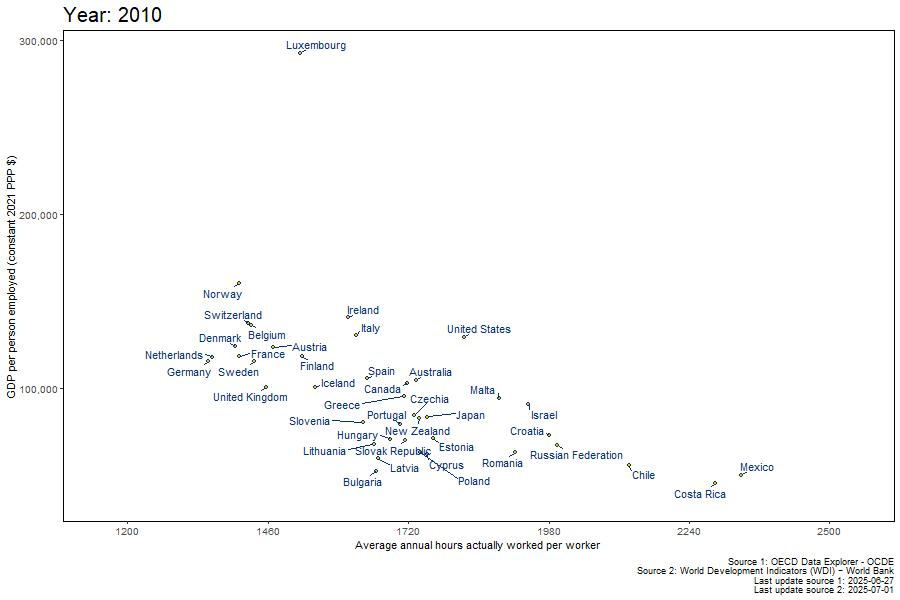

```{r}
#| label: libraries

library(tidyverse)
library(readxl)
library(gt)

# See 000_gifs/003_gdp_emp_hw_plot_anim.R
## library(wbstats)
## library(janitor)
## library(ggrepel)
## library(scales)
## library(gganimate)
```

```{r}
#| label: palette

umng_palette <- c(
  "#043074",
  "#fdc600",
  "#0d5e30",
  "#ee2a24",
  "#fc6700",
  "#00b3f0",
  "#6e3c1a",
  "#f8941c",
  "#8e44ad",
  "#2c3e50",
  "#16a085",
  "#c0392b",
  "#e91e63"
)
```

# Please Read Me

##

-   Check the message **Welcome greeting** published in Announcements forum.

-   Dear student please edit your profile uploading a photo where your face is clearly visible.

-   If you want to participate, please fill out the following survey: **Primer corte 30% > Learning Activities > Tu opinión sobre la economía colombiana**

-   This presentation is based on [@cardenas_introduccion_2020, Chapter 3]

## 

- **Purpose**

    - Analyze the determinants of economic growth

# Inputs to obtain GDP

## 

Gross domestic product is obtained by using the following inputs:

-   Labor

    -   Quantity of labor:
        -   Employment[^1]
        -   Hours worked
    -   Quality of Labor:
        -   Employment by educational attainment
        -   Compensation by educational attainment

[^1]: Includes individuals employed aged 15 years or over where this age range is necessary for international comparisons.

## {.smaller} 

Gross domestic product is obtained by using the following inputs[^2]:

-   Produced non-financial fixed assets[^3]

    -   Dwellings
    -   Other buildings and structures
        -   Buildings other than dwellings
        -   Other structures
        -   Land improvements
    -   Machinery and equipment
        -   Transport equipment
        -   Information and Computer Technology (ICT) equipment
        -   Other machinery and equipment
    -   Weapons systems
    -   Cultivated biological resources

[^2]: These categories are taken from [@united_nations_system_2009, p. 555]

[^3]: Other non-financial assets can be included but these are the ones that are usually measured. For more information check out [@oecd_measuring_2009] and [@oecd_measuring_2001]

## 

Other factors that affect the Gross Domestic Product different from labor and produced non-financial fixed assets

-   These factors are not directly observable but are used in growth accounting to calculate **Total Factor Productivity/Multifactor productivity** as an approximation to technological change

    -   Technological change is defined as changes in the Gross Domestic Product that are not due to changes in inputs

# Growth accounting

## 

![Labor productivity and total factor productivity [@de_vries_total_2022, page 21, fig 6]](_000_images/003_labor_productivity_total_factor_productivity.png){.nostretch #fig-labor-factor-productivity-total-factor-productivity fig-align="center" width=90%}

## {.center}

```{r}
# Data
# https://www.conference-board.org/us/ > 
# myTBC Member Sign In > 
# Data >
# Data Central > 
# TCB DATASETS > 
# Total Economy Database - Growth Accounting and Total Factor Productivity
# You need to have a free account
# Username: l*********m@gmail.com
# Password: U**********4

# Import
data_ted_col <- read_csv(file = '000_data/003_tidy_TED2.csv.gz')

# Tidy
data_ted_col_clean <- data_ted_col |> 
  filter(unit_code == 'COL') |> 
  filter(date %in% c(1990, 2010, 2020, 2024)) |> 
  filter(variable_label %in% c('Growth in real GDP',
                               'Contribution of Labor Quality to real GDP growth',
                               'Contribution of Labor Quantity to real GDP growth',
                               'Contribution of Total Capital Services to real GDP growth',
                               'Growth of Total Factor Productivity')) |> 
  select(date, variable_label, values) |> 
  pivot_wider(id_cols = variable_label, 
              names_from = date, values_from = values) |> 
  rename(Measure = variable_label)

# Helpers
last_data_ted_col_clean <- ymd("2025-05-06")
```

```{r}
#| label: tbl-growth-accounting-col
#| tbl-cap: Growth accounting applied to Colombia for selected years
#| html-table-processing: none

# Table
data_ted_col_clean |> 
  gt() |> 
  tab_style(
    style = cell_text(weight = "bold"),
    locations = cells_column_labels()
  ) |> 
  tab_source_note(
    source_note = "Source: Total Economy Database - Growth Accounting and Total Factor Productivity"
  ) |>
  tab_source_note(
    source_note = str_glue("Last update: {last_data_ted_col_clean}")
  ) |> 
  tab_style(
    style = cell_fill(color = umng_palette[2]),
    locations = cells_body(rows = 1)
  ) |> 
  tab_style(
    style = cell_fill(color = umng_palette[4]),
    locations = cells_body(rows = 2:3)
  ) |> 
  tab_style(
    style = cell_fill(color = umng_palette[5]),
    locations = cells_body(rows = 4)
  ) |> 
  tab_style(
    style = cell_fill(color = umng_palette[6]),
    locations = cells_body(rows = 5)
  ) |>
  tab_options(
    row.striping.include_table_body = TRUE,
    table.border.top.width = px(3),
    table.border.top.color = "black",
    column_labels.border.bottom.width = px(2),
    column_labels.border.bottom.color = "black",
    table.border.bottom.width = px(3),
    table.border.bottom.color = "black",
    table.font.size = px(22)
  )
```

# Case study: number of hours worked

##

<!-- Check out 000_gifs/003_gdp_emp_hw_plot_anim.R -->

{.nostretch #fig-gdp-emp-hw width=80% fig-align="center"}

# Proximate and fundamental determinants of economic growth

## 

-   Proximate determinants

    -   Increase in workers and worked hours
    -   Increase in produced non-financial fixed assets
    -   Increase in educational attainment, experience and skills (lifelong learning)
    -   Increase in overall efficiency of production (total factor productivity)

## 

-   Fundamental determinants

    -   Better institutions [@cardenas_introduccion_2020, Chapter 4]
    -   Integration into the global economy [@cardenas_introduccion_2020, Chapter 5]
    -   Geographical conditions

# Acknowledgments

##

-   To my family that supports me

-   To the taxpayers of Colombia and the [**UMNG students**](https://www.umng.edu.co/estudiante) who pay my salary

-   To the [**Business Science**](https://www.business-science.io/) and [**R4DS Online Learning**](https://www.rfordatasci.com/) communities where I learn [**R**](https://www.r-project.org/about.html) and [**$\pi$-thon**](https://www.python.org/about/)

-   To the [**R Core Team**](https://www.r-project.org/contributors.html), the creators of [**RStudio IDE**](https://posit.co/download/rstudio-desktop/), [**Positron**](https://positron.posit.co/), [**Quarto**](https://quarto.org/) and the authors and maintainers of the packages [**tidyverse**](https://CRAN.R-project.org/package=tidyverse),
[**readxl**](https://CRAN.R-project.org/package=readxl), [**wbstats**](https://CRAN.R-project.org/package=wbstats),
[**janitor**](https://CRAN.R-project.org/package=janitor), 
[**ggrepel**](https://CRAN.R-project.org/package=ggrepel),
[**gt**](https://CRAN.R-project.org/package=gt),
[**wbstats**](https://CRAN.R-project.org/package=wbstats), 
[**scales**](https://CRAN.R-project.org/package=scales), [**gganimate**](https://CRAN.R-project.org/package=gganimate) and [**tinytex**](https://CRAN.R-project.org/package=tinytex) for allowing me to access these tools without paying for a license

# References {.allowframebreaks}