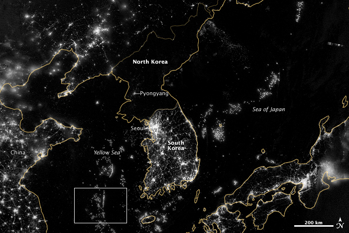
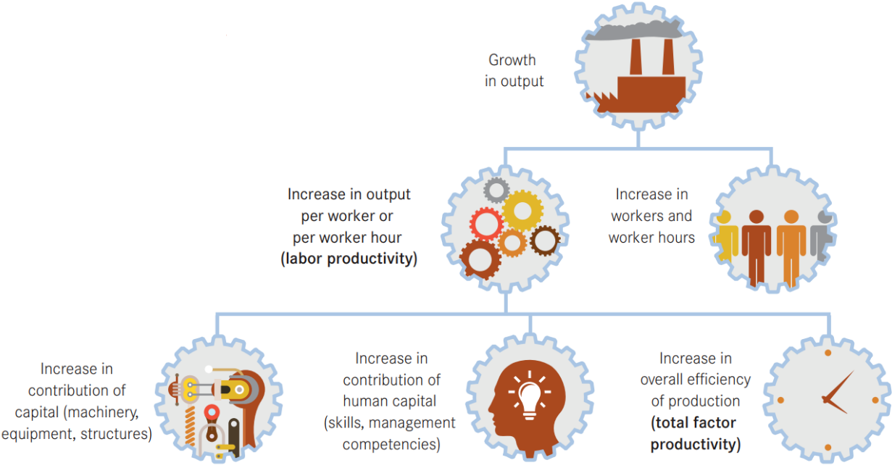

```{r setup, include=FALSE}
knitr::opts_chunk$set(echo      = FALSE, 
                      warning   = FALSE, 
                      message   = FALSE,
                      fig.align = "center")
```

```{r}
library(tidyverse)
library(knitr)
library(janitor)
library(kableExtra)
```

# Contents

- Please Read Me
- Purpose
- What is economic growth?
- Economic growth from a long-term perspective
- Economic growth paths
- Economic growth in images
- Inputs to obtain GDP
- Growth accounting
- Proximate and fundamental determinants of economic growth
- Acknowledgments
- References

# Please Read Me

- Check the message __Welcome greeting__ published in the News Bulletin Board.

- Dear student please edit your profile uploading a photo where your face is clearly visible.

- The purpose of the virtual meetings is to answer questions and not to make a summary of the study material.

- This presentation is based on [@cardenas_santamaria_introduccion_2013, Chapter 3]

# Purpose

Analyze the determinants of economic growth

# What is economic growth?

- Economic growth can be define as an increase in the quantity and quality of products that a society produces and consumes [@roser_economic_2013]

- The definition of economic growth is straightforward but this concept is extremely difficult to measure [@roser_economic_2013]

- Economists often measure economic growth as an increase in Gross Domestic Product per capita by applying inflation adjustments. Furthermore, if international comparisons are necessary also purchase power parity (PPP) adjustments are applied [@roser_economic_2013]

- From the long-term perspective of social history economic growth is a recent phenomena [@roser_economic_2013] & [@bolt_maddison_2020]

# Economic growth from a long-term perspective

```{r out.width="90%"}
data_madison_region_gdp_per_capita <- readxl::read_excel("000_data/003_mpd2020.xlsx",
                   sheet = 6,
                   range = "A4:S26",
                   col_names = FALSE,
                   trim_ws = TRUE) %>% 
  select(1, 5, 19) %>% 
  set_names(nm = c("year", "Latin America", "World")) %>% 
  filter(!(is.na(`Latin America`) | is.na(World))) %>% 
  pivot_longer(cols = `Latin America`:`World`, 
               names_to = "region", 
               values_to = "gpd_per_capita")


data_madison_region_gdp_per_capita %>%
  ggplot(aes(x = year,
             y = gpd_per_capita)) +
  geom_point(aes(fill = region),
             color = "black", shape = 21,
             show.legend = FALSE) +
  geom_line(aes(color = region,
                group = region)) +
  tidyquant::scale_color_tq() +
  tidyquant::scale_fill_tq() +
  expand_limits(y = 0) +
  labs(x        = "Year",
       y        = "Thousands",
       color = NULL,
       title    = "GDP per-capita purchasing power parity, Latin America and the World",
       subtitle = str_glue("Variable units: constant 2011 international USD
                           Period: {str_c(c(unique(data_madison_region_gdp_per_capita$year)[1:13], '2016-2018'), collapse = ', ')}"),
       caption  = str_glue("Source: Maddison Project Database, version 2020 (Bolt and Zanden 2020)
                             Last update date: 2020-11-02")) +
  scale_x_continuous(breaks = c(unique(data_madison_region_gdp_per_capita$year)[1:13], 2018)) +
  scale_y_continuous(labels = scales::number_format(scale    = 1e-3,
                                                    suffix   = "K",
                                                    accuracy = 1)) +
  theme(panel.border    = element_rect(fill = NA, color = "black"),
        plot.background   = element_rect(fill = "#f3fcfc"),
        panel.background  = element_rect(fill = "#f3f7fc"),
        legend.background = element_rect(fill = "#f3fcfc"),
        legend.position   = "bottom",
        plot.title        = element_text(face = "bold"),
        axis.title        = element_text(face = "bold"),
        legend.title      = element_text(face = "bold"),
        axis.text         = element_text(face = "bold"), 
        axis.text.x       = element_text(angle = 90, 
                                         vjust = 0.5))
```

# Economic growth paths

```{r out.width="90%"}
data_madison_country_gdp_per_capita <- readxl::read_excel("000_data/003_mpd2020.xlsx",
                   sheet = 3,
                   range = "A1:E21683",
                   trim_ws = TRUE)

data_madison_country_usa_col_kor <- data_madison_country_gdp_per_capita %>%
  filter(countrycode %in% c("USA", "COL", "KOR"),
         year %in% 1911:2018)
  
data_madison_country_usa_col_kor %>% 
  ggplot(aes(x = year,
             y = gdppc)) +
  geom_line(aes(color = country,
                group = country)) +
  tidyquant::scale_color_tq() +
  tidyquant::scale_fill_tq() +
  expand_limits(y = 0) +
  labs(x        = "Year",
       y        = "Thousands",
       color = NULL,
       title    = "GDP per-capita purchasing power parity, Colombia, USA and South Korea",
       subtitle = str_glue("Variable units: constant 2011 international USD
                           Period: {min(data_madison_country_usa_col_kor$year)}-{max(data_madison_country_usa_col_kor$year)}
                           No information for South Korea in 1944-1945"),
       caption  = str_glue("Source: Maddison Project Database, version 2020 (Bolt and Zanden 2020)
                             Last update date: 2020-11-02")) +
  scale_x_continuous(breaks = seq.int(from = min(data_madison_country_usa_col_kor$year), 
                                        to = max(data_madison_country_usa_col_kor$year), 
                                        by = 5)) + 
  scale_y_continuous(labels = scales::number_format(scale    = 1e-3,
                                                    suffix   = "K",
                                                    accuracy = 1)) +
  theme(panel.border    = element_rect(fill = NA, color = "black"),
        plot.background   = element_rect(fill = "#f3fcfc"),
        panel.background  = element_rect(fill = "#f3f7fc"),
        legend.background = element_rect(fill = "#f3fcfc"),
        legend.position   = "bottom",
        plot.title        = element_text(face = "bold"),
        axis.title        = element_text(face = "bold"),
        legend.title      = element_text(face = "bold"),
        axis.text         = element_text(face = "bold"))
```

# Economic growth paths

```{r out.width="90%"}
data_madison_country_hti_dom <- data_madison_country_gdp_per_capita %>%
  filter(countrycode %in% c("HTI", "DOM"),
         year %in% 1950:2018)
  
data_madison_country_hti_dom %>% 
  ggplot(aes(x = year,
             y = gdppc)) +
  geom_line(aes(color = country,
                group = country)) +
  tidyquant::scale_color_tq() +
  tidyquant::scale_fill_tq() +
  expand_limits(y = 0) +
  labs(x        = "Year",
       y        = "Thousands",
       color = NULL,
       title    = "GDP per-capita purchasing power parity, Haiti and Dominican Republic",
       subtitle = str_glue("Variable units: constant 2011 international USD
                           Period: {min(data_madison_country_hti_dom$year)}-{max(data_madison_country_hti_dom$year)}"),
       caption  = str_glue("Source: Maddison Project Database, version 2020 (Bolt and Zanden 2020)
                             Last update date: 2020-11-02")) +
  scale_x_continuous(breaks = seq.int(from = min(data_madison_country_hti_dom$year), 
                                        to = max(data_madison_country_hti_dom$year), 
                                        by = 10)) + 
  scale_y_continuous(labels = scales::number_format(scale    = 1e-3,
                                                    suffix   = "K",
                                                    accuracy = 1)) +
  theme(panel.border    = element_rect(fill = NA, color = "black"),
        plot.background   = element_rect(fill = "#f3fcfc"),
        panel.background  = element_rect(fill = "#f3f7fc"),
        legend.background = element_rect(fill = "#f3fcfc"),
        legend.position   = "bottom",
        plot.title        = element_text(face = "bold"),
        axis.title        = element_text(face = "bold"),
        legend.title      = element_text(face = "bold"),
        axis.text         = element_text(face = "bold"))
```

# Economic growth paths

```{r out.width="90%"}
data_madison_country_col_ven <- data_madison_country_gdp_per_capita %>%
  filter(countrycode %in% c("COL", "VEN"),
         year %in% 1900:2018)
  
data_madison_country_col_ven %>% 
  ggplot(aes(x = year,
             y = gdppc)) +
  geom_line(aes(color = country,
                group = country)) +
  tidyquant::scale_color_tq() +
  tidyquant::scale_fill_tq() +
  expand_limits(y = 0) +
  labs(x        = "Year",
       y        = "Thousands",
       color = NULL,
       title    = "GDP per-capita purchasing power parity, Colombia and Venezuela",
       subtitle = str_glue("Variable units: constant 2011 international USD
                           Period: {min(data_madison_country_col_ven$year)}-{max(data_madison_country_col_ven$year)}"),
       caption  = str_glue("Source: Maddison Project Database, version 2020 (Bolt and Zanden 2020)
                             Last update date: 2020-11-02")) +
  scale_x_continuous(breaks = seq.int(from = min(data_madison_country_col_ven$year), 
                                        to = max(data_madison_country_col_ven$year), 
                                        by = 10)) + 
  scale_y_continuous(labels = scales::number_format(scale    = 1e-3,
                                                    suffix   = "K",
                                                    accuracy = 1)) +
  theme(panel.border    = element_rect(fill = NA, color = "black"),
        plot.background   = element_rect(fill = "#f3fcfc"),
        panel.background  = element_rect(fill = "#f3f7fc"),
        legend.background = element_rect(fill = "#f3fcfc"),
        legend.position   = "bottom",
        plot.title        = element_text(face = "bold"),
        axis.title        = element_text(face = "bold"),
        legend.title      = element_text(face = "bold"),
        axis.text         = element_text(face = "bold"))
```

# Economic growth in images

- Shanghai's financial district of Pudong: 1987 vs 2013 [@taylor_26_2013]

```{r out.width="49%", fig.show='hold', fig.align='center'}
knitr::include_graphics(c("_000_images/003_pudong_1987.png",
                          "_000_images/003_pudong_2013.png"))
```

# Economic growth in images

- Korean peninsula, nocturnal luminosity: September 24, 2012
 [@nasa_earth_observatory_korea_2012]
 
```{r out.width="75%"}

```

# Economic growth in images

- Google Earth Timelapse Dubai, UAE check out[^1]:

    + https://youtu.be/pjM26oRIay0
    
- Explore about Timelapse at: https://earthengine.google.com/timelapse

    + Urban growth
    
        + Dalian, Liaoning, China
        + Las Vegas, Nevada, USA
    
[^1]: Timelapse is a global, zoomable video that lets you see how the Earth has changed over the past 32 years. 

# Inputs to obtain GDP

Gross domestic product is obtained by using the following inputs:

- Labor

    + Quantity of labor:
        + Employment[^2]
        + Hours worked
    + Quality of Labor:
        + Employment by educational attainment
        + Compensation by educational attainment

[^2]: Includes individuals employed aged 15 years or over where this age range is necessary for international comparisons.

# Inputs to obtain GDP

Gross domestic product is obtained by using the following inputs:

- Produced non-financial fixed assets[^3]

    + Dwellings
    + Buildings other than dwellings
    + Other structures
    + Land improvements
    + Transport equipment
    + Information and Computer Technology (ICT) equipment
    + Other machinery and equipment
    + Weapons systems
    + Cultivated biological resources

[^3]: Other non-financial assets can be included but these are the ones that are usually measured. For more information check out [@oecd_measuring_2009] and [@oecd_measuring_2001]

# Inputs to obtain GDP

Other factors that affect the Gross Domestic Product different from labor and produced non-financial fixed assets

- These factors are not directly observable but are used in growth accounting to calculate **Total Factor Productivity/Multifactor productivity** as an approximation to technological change

    + Technological change is defined as changes in the Gross Domestic Product that are not due to changes in inputs
    
# Growth accounting

- Labor productivity and total factor productivity [@de_vries_total_2017, p. 21, fig. 3]

```{r out.width="90%"}

```

# Growth accounting

- Methodology applied to Colombia for selected years

```{r}
data_ted_col <- readxl::read_excel("000_data/003_total_economy_database2_2021-08.xlsx",
                   sheet = 2,
                   range = "A5:AL2133",
                   trim_ws = TRUE) %>% 
  set_names(nm = c(make_clean_names(string = c("REGION", "ISO", "COUNTRY", "NR", 
                                               "INDICATOR", "MEASURE")),
                   as.character(1990:2021))) %>% 
  filter(iso == "COL", 
         indicator %in% c("GDP", "Labor Quantity Contribution",
                          "Labor Quality Contribution", "Total Capital Contribution",
                          "Total Factor Productivity")) %>% 
  select(measure, `1990`, `2000`, `2010`, `2020`)

data_ted_col %>% 
  rename(Measure = measure) %>%
  kable(booktabs = TRUE, escape = FALSE, digits = 2) %>%
  kable_styling(font_size = 9) %>% 
  column_spec(column = 1, width = "2.5in") %>%
  row_spec(row = 1, background = '#e31a1c') %>% 
  row_spec(row = 2:3, background = '#18BC9C') %>%
  row_spec(row = 4, background = '#CCBE93') %>%
  row_spec(row = 5, background = '#FF7F00') %>%
  footnote(general       = c('Source: The Conference Board Total Economy Database - Growth Accounting and Total Factor Productivity, 1990-2021', 'Last update: 2021-08'),
           general_title = "",
           threeparttable = TRUE)
```

# Proximate and fundamental determinants of economic growth

- Proximate determinants 

    + Increase in workers and worked hours
    + Increase in produced non-financial fixed assets
    + Increase in educational attainment, experience and skills (lifelong learning)
    + Increase in overall efficiency of production (total factor productivity)
    
# Proximate and fundamental determinants of economic growth

- Fundamental determinants

    + Better institutions [@cardenas_santamaria_introduccion_2013, Chapter 4]
    + Integration into the global economy [@cardenas_santamaria_introduccion_2013, Chapter 5]
    + Geographical conditions

# Acknowledgments

- To my family that supports me

- To the taxpayers of Colombia and the __[UMNG students](https://www.umng.edu.co/estudiante)__ who pay my salary

- To the __[Business Science](https://www.business-science.io/)__ and __[R4DS Online Learning](https://www.rfordatasci.com/)__ communities where I learn __[R](https://www.r-project.org/about.html)__ 

- To the __[R Core Team](https://www.r-project.org/contributors.html)__, the creators of __[RStudio IDE](https://rstudio.com/products/rstudio/)__ and the authors and maintainers of the packages  __[tidyverse](https://CRAN.R-project.org/package=tidyverse)__, __[knitr](https://CRAN.R-project.org/package=knitr)__, __[janitor](https://CRAN.R-project.org/package=janitor)__, __[kableExtra](https://CRAN.R-project.org/package=kableExtra)__, and __[tinytex](https://CRAN.R-project.org/package=tinytex)__ for allowing me to access these tools without paying for a license

- To the __[Linux kernel community](https://www.kernel.org/category/about.html)__ for allowing me the possibility to use some __[Linux distributions](https://static.lwn.net/Distributions/)__ as my main __[OS](https://en.wikipedia.org/wiki/Operating_system)__ without paying for a license

# References {.allowframebreaks}
