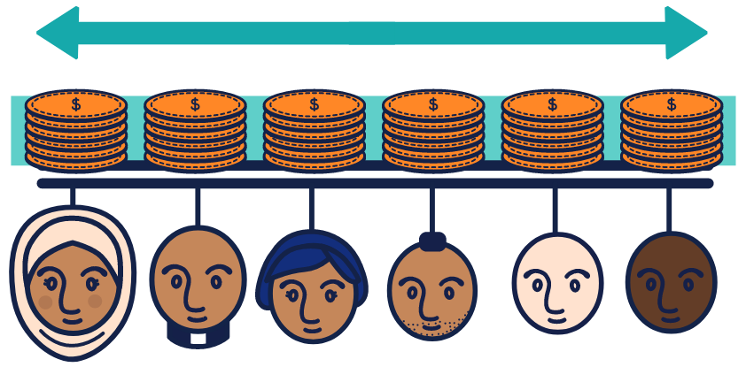
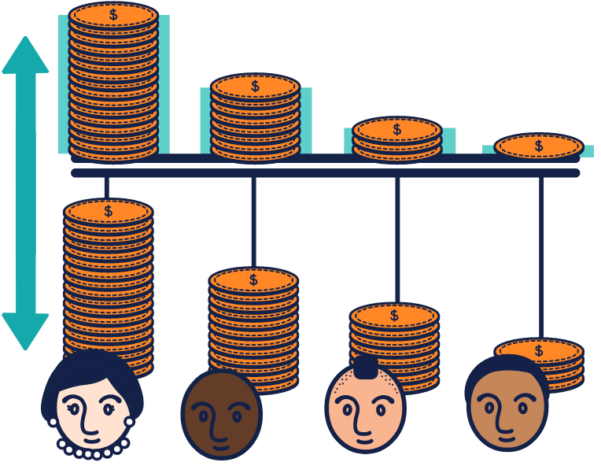
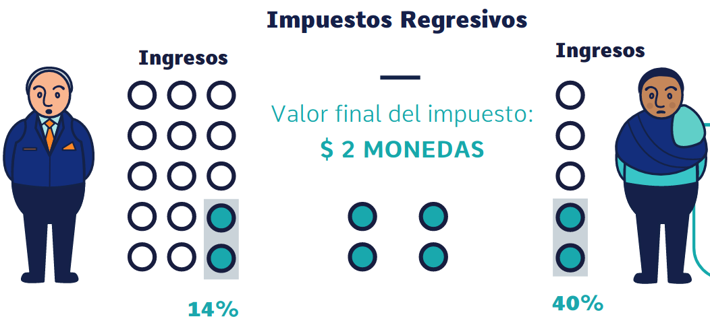
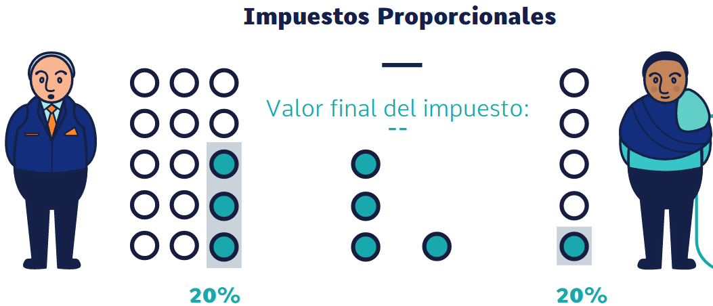
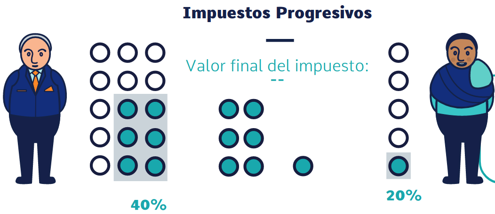

```{r}
#| label: libraries

library(tidyverse)
library(readxl)
library(gt)
library(scales)
library(janitor)
```

```{r}
#| label: palette

umng_palette <- c(
  "#043074",
  "#fdc600",
  "#0d5e30",
  "#ee2a24",
  "#fc6700",
  "#00b3f0",
  "#6e3c1a",
  "#f8941c",
  "#8e44ad",
  "#2c3e50",
  "#16a085",
  "#c0392b",
  "#e91e63"
)
```

# Please Read Me

##

-   Check the message **Welcome greeting** published in Announcements forum.

-   Dear student please edit your profile uploading a photo where your face is clearly visible.

-   If you want to participate, please fill out the following survey: **Primer corte 30% > Learning Activities > Tu opinión sobre la economía colombiana**

-   This presentation is based on [@cardenas_introduccion_2020, Chapter 6]

##

- **Purpose**

    - Explain the role of the State in the economy

# Economic functions of government

## {.smaller}

-   What are the economic functions of government? [@council_for_economic_education_focus_2010, pp. 45-54]

    -   **Maintain the Legal and Social Framework**

        -   Define and enforce property rights
        -   Establish a monetary system

    -   **Maintain competition in the marketplace**

        -   Create and enforce antitrust laws
        -   Regulate natural monopolies

    -   **Provide public goods and services**

        -   Some goods and services are not provided by the market in the quantities desired by society

## {.smaller}

-   What are the economic functions of government? [@council_for_economic_education_focus_2010, pp. 45-54]

    -   **Correct for externalities**

        -   Reduce negative externalities
        -   Encourage increased production of goods and services that have positive externalities

    -   **Stabilize the economy**

        -   Reduce unemployment and inflation
        -   Promote economic growth

    -   **Redistribute income**

        -   Targeting public spending
        -   Collect taxes

# Colombian public sector

##

```{mermaid}
%%| label: fig-division-public-sector-cuin-col
%%| fig-cap: Division based on [@international_monetary_fund_government_2014, fig. 2.3] and **Clasificación entidades según Código Único Institucional - CUIN**[^1]

flowchart TB
    A("`Sector público`") --> A1("`Sociedad pública
    no financiera`") --> A11("`Sociedad
    no
    financiera
    pública`")
    A("`Sector público`") --> A2("`Sociedad pública
    financiera`") 
    A2 --> A21("`Banco
    central`")
    A2 --> A22("`Sociedades de
    depósitos
    públicas
    excepto
    banco central`")
    A2 --> A23("`Otras
    sociedades
    financieras
    públicas`")
    A --> A3("`Gobierno
    general`")
    A3 --> A31("`Gobierno
    central`")
    A3 --> A32("`Gobierno
    departamental`")
    A3 --> A33("`Gobierno
    municipal`")
    A3 --> A34("`Seguridad
    social`")
    
    classDef UmngNode fill:#fdc600,stroke:#043074,stroke-width:2px;
    class A,A1,A11,A2,A21,A22,A23,A3,A31,A32,A33,A34 UmngNode;
```

[^1]: [https://www.contaduria.gov.co/clasificacion-entidades-segun-cuin](https://www.contaduria.gov.co/clasificacion-entidades-segun-cuin)

##

```{mermaid}
%%| label: fig-division-public-sector-minhacienda-col
%%| fig-cap: Division based on how the difference balances are reported by MinHacienda[^2]
%%| fig-width: 7.9
%%| fig-height: 5.4

%% https://www.minhacienda.gov.co > 
%% Procesos Misionales > 
%% Política Fiscal > 
%% Política Fiscal >
%% Cifras de Política Fiscal > 

%%%% Estadísticas de finanzas públicas con base en estándares internacionales > 
%%%% Estadísticas oficiales > 
%%%% MHCP: Estadísticas oficiales del Sector Públicos Consolidado >
%%%% Balance Sector Público Consolidado >
%%%% Cifras históricas SPC 2001-2019

%%%% SPNF >
%%%% SPNF >
%%%% Balance SPNF

%%%% Gobierno General >
%%%% Gobierno General >
%%%% Balance Gobierno General
%%%% Gobierno General (por subsector) 2008 2023

%%%% Gobierno Nacional Central >
%%%% Gobierno Nacional Central >
%%%% Balance Gobierno Nacional Central

%%%%%% - 1. Balance Sector Público Consolidado
%%%%%% - 1.1 Balance Sector Público Financiero
%%%%%% - 1.2 Balance Sector Público No Financiero
%%%%%% - 1.2.1 Balance Gobierno General
%%%%%% - 1.2.1.1 Balance Gobierno Nacional Central

flowchart LR
    A("`Sector Público Consolidado
    **SPC**`") --> A1("`Sector Público Financiero
    **SPF**`")
    A1 --> A11("`Banco de la República`")
    A1 --> A12("`Fogafín`")
    A --> A2("`Sector Público no Financiero 
    **SPNF**`")
    A2 --> A21("`Gobierno General
    **GG**`")
    A21 --> A211("`Gobierno Central
    **GC**`")
    A211 --> A2111("`Gobierno Nacional Central
    **GNC**`")
    A211 --> A2112("`Resto del
    Nivel Central`")
    A21 --> A212("`Regionales y Locales`")
    A21 --> A213("`Seguridad Social`")
    A2 --> A22("`Empresas Públicas`")
    A22 --> A221("`Nivel Nacional`")
    A22 --> A222("`Nivel Local`")
    A2 --> A23("`Sector Público no Modelado
    **SPNM**`")

    classDef UmngNode fill:#fdc600,stroke:#043074,stroke-width:2px;
    class A,A1,A11,A12,A2,A21,A22,A23,A211,A212,A213,A221,A222,A2111,A2112 UmngNode;
```

[^2]: [https://www.minhacienda.gov.co/politica-fiscal](https://www.minhacienda.gov.co/politica-fiscal)

## {.smaller} 

-   Central National Government (Gobierno Nacional Central (GNC)) Fiscal Balance

    -   The fiscal balance is the difference between the central national government’s revenues and its expenditures

    -   It shows the extent to which expenditure in a given year is financed by the revenues collected in that year [@oecd_government_2021, p. 68]

        -   When the central national government spends more than it collects as revenues, it has a **fiscal deficit**

        -   When the central national government spends less than it collects as revenues, it has a **fiscal surplus**

##

```{r}
# Data
# https://www.minhacienda.gov.co >
# Procesos Misionales >
# Política Fiscal >
# Política Fiscal >
# Cifras de Política Fiscal >
# Gobierno Nacional Central >
# Balance Gobierno Nacional Central >
# Balance Gobierno Nacional Central 1994-2024

# Import
cng_fb <- read_excel(
  path = "000_data/006_balance_gobierno_nacional_central_1994-2024.xlsx",
  # %PIB-CIERRE FISCAL anual
  sheet = 2,
  range = "B5:AG101"
)

# Helpers
last_update_fiscal_balance_gnc <- ymd("2025-01-09")

# Tidy
cng_fb_clean <- cng_fb |>
  rename(Concepto = "CONCEPTO") |>
  slice(-c(1:2, 4, 34, 36, 51, 53, 55, 72, 74, 76, 78, 80, 82, 84, 95)) |>
  select(Concepto, `2024`)
```

```{r}
#| label: tbl-ingresos-tributarios-no-tributarios-col-1
#| tbl-cap: Ingresos tributarios y no tributarios (% PIB)
#| html-table-processing: none

# Table
cng_fb_table_tax_non_tax_revenues <- cng_fb_clean |>
  slice(2:5, 8:27, 30)

cng_fb_table_tax_non_tax_revenues |>
  slice(1:21) |>
  gt() |>
  fmt_number(
    columns = -Concepto,
    decimals = 2
  ) |>
  tab_footnote(
    footnote = "%PIB - Cierre fiscal",
    locations = cells_column_labels(columns = 2)
  ) |>
  tab_source_note(
    source_note = "Source: Ministerio de Hacienda y Crédito Público - Balance Gobierno Nacional Central"
  ) |>
  tab_source_note(
    source_note = str_glue("Last update: {last_update_fiscal_balance_gnc}")
  ) |>
  ## INGRESOS TRIBUTARIOS
  tab_style(
    style = cell_text(indent = px(10)),
    locations = cells_body(rows = 2)
  ) |>
  ## DIAN
  tab_style(
    style = cell_text(indent = px(20)),
    locations = cells_body(rows = 3)
  ) |>
  tab_style(
    style = cell_text(indent = px(30)),
    locations = cells_body(rows = 4:21)
  ) |>
  tab_style(
    style = cell_fill(color = umng_palette[6]),
    locations = cells_body(rows = 1)
  ) |>
  tab_style(
    style = cell_fill(color = umng_palette[11]),
    locations = cells_body(rows = 2)
  ) |>
  tab_style(
    style = cell_fill(color = umng_palette[5]),
    locations = cells_body(rows = 3)
  ) |>
  tab_options(
    row.striping.include_table_body = TRUE,
    table.border.top.width = px(3),
    table.border.top.color = "black",
    column_labels.border.bottom.width = px(2),
    column_labels.border.bottom.color = "black",
    table.border.bottom.width = px(3),
    table.border.bottom.color = "black",
    table.font.size = px(14),
    footnotes.marks = "letters",
    data_row.padding = px(2)
  )
```

## {.center}

```{r}
#| label: tbl-ingresos-tributarios-no-tributarios-col-2
#| tbl-cap: Ingresos tributarios y no tributarios (% PIB)
#| html-table-processing: none

cng_fb_table_tax_non_tax_revenues |>
  slice(1, 22:25) |>
  gt() |>
  fmt_number(
    columns = -Concepto,
    decimals = 2
  ) |>
  tab_footnote(
    footnote = "%PIB - Cierre fiscal",
    locations = cells_column_labels(columns = 2)
  ) |>
  tab_source_note(
    source_note = "Source: Ministerio de Hacienda y Crédito Público - Balance Gobierno Nacional Central"
  ) |>
  tab_source_note(
    source_note = str_glue("Last update: {last_update_fiscal_balance_gnc}")
  ) |>
  ## INGRESOS NO TRIBUTARIOS
  tab_style(
    style = cell_text(indent = px(10)),
    locations = cells_body(rows = 2)
  ) |>
  tab_style(
    style = cell_text(indent = px(30)),
    locations = cells_body(rows = 3:5)
  ) |>
  tab_style(
    style = cell_fill(color = umng_palette[6]),
    locations = cells_body(rows = 1)
  ) |>
  tab_style(
    style = cell_fill(color = umng_palette[11]),
    locations = cells_body(rows = 2)
  ) |>
  tab_options(
    row.striping.include_table_body = TRUE,
    table.border.top.width = px(3),
    table.border.top.color = "black",
    column_labels.border.bottom.width = px(2),
    column_labels.border.bottom.color = "black",
    table.border.bottom.width = px(3),
    table.border.bottom.color = "black",
    table.font.size = px(18),
    footnotes.marks = "letters",
    data_row.padding = px(2)
  )
```

##

```{r}
#| label: tbl-ingresos-totales-col
#| tbl-cap: Ingresos totales (% PIB)
#| html-table-processing: none

# Table
cng_fb_table_total_revenue <- cng_fb_clean |>
  slice(1:3, 25, 31:45)

cng_fb_table_total_revenue |>
  gt() |>
  fmt_number(
    columns = -Concepto,
    decimals = 2
  ) |>
  tab_footnote(
    footnote = "%PIB - Cierre fiscal",
    locations = cells_column_labels(columns = 2)
  ) |>
  tab_source_note(
    source_note = "Source: Ministerio de Hacienda y Crédito Público - Balance Gobierno Nacional Central"
  ) |>
  tab_source_note(
    source_note = str_glue("Last update: {last_update_fiscal_balance_gnc}")
  ) |>
  ## INGRESOS CORRIENTES DE LA NACION
  ## FONDOS ESPECIALES
  ## OTROS RECURSOS DE CAPITAL
  tab_style(
    style = cell_text(indent = px(10)),
    locations = cells_body(rows = c(2, 5:6))
  ) |>
  ## INGRESOS TRIBUTARIOS
  ## INGRESOS NO TRIBUTARIOS
  tab_style(
    style = cell_text(indent = px(20)),
    locations = cells_body(rows = c(3:4))
  ) |>
  ## Rendimientos Financieros Totales
  ## Excedentes Financieros
  ## Recuperación de cartera diferente SPNF
  ## Otros recursos
  tab_style(
    style = cell_text(indent = px(30)),
    locations = cells_body(rows = c(7:8, 16:17))
  ) |>
  ## Ecopetrol to Resto de empresas
  ## Reintegros y recursos no apropiados to Resto
  tab_style(
    style = cell_text(indent = px(40)),
    locations = cells_body(rows = c(9:15, 18:19))
  ) |>
  tab_style(
    style = cell_fill(color = umng_palette[2]),
    locations = cells_body(rows = 1)
  ) |>
  tab_style(
    style = cell_fill(color = umng_palette[11]),
    locations = cells_body(rows = 3)
  ) |>
  tab_options(
    row.striping.include_table_body = TRUE,
    table.border.top.width = px(3),
    table.border.top.color = "black",
    column_labels.border.bottom.width = px(2),
    column_labels.border.bottom.color = "black",
    table.border.bottom.width = px(3),
    table.border.bottom.color = "black",
    table.font.size = px(15),
    footnotes.marks = "letters",
    data_row.padding = px(2)
  )
```

##

```{r}
#| label: tbl-ingresos-pagos-totales-col
#| tbl-cap: Ingresos y pagos totales (% PIB)
#| html-table-processing: none

# Table
cng_fb_table_total_revenue_payments <- cng_fb_clean |>
  slice(1:3, 25, 31:32, 46:56, 60:63)

cng_fb_table_total_revenue_payments |>
  gt() |>
  fmt_number(
    columns = -Concepto,
    decimals = 2
  ) |>
  tab_footnote(
    footnote = "%PIB - Cierre fiscal",
    locations = cells_column_labels(columns = 2)
  ) |>
  tab_source_note(
    source_note = "Source: Ministerio de Hacienda y Crédito Público - Balance Gobierno Nacional Central"
  ) |>
  tab_source_note(
    source_note = str_glue("Last update: {last_update_fiscal_balance_gnc}")
  ) |>
  ## INGRESOS CORRIENTES DE LA NACION
  ## FONDOS ESPECIALES
  ## OTROS RECURSOS DE CAPITAL
  ## PAGOS TOTALES SIN INTERESES
  ## PAGOS CORRIENTES DE LA NACION
  ## INVERSION
  tab_style(
    style = cell_text(indent = px(10)),
    locations = cells_body(rows = c(2, 5:6, 8:9, 21))
  ) |>
  ## INGRESOS TRIBUTARIOS
  ## INGRESOS NO TRIBUTARIOS
  ## INTERESES
  ## FUNCIONAMIENTO
  tab_style(
    style = cell_text(indent = px(20)),
    locations = cells_body(rows = c(3:4, 10, 14))
  ) |>
  ## Servicios personales
  ## Transferencias
  ## Gastos generales y otros
  tab_style(
    style = cell_text(indent = px(30)),
    locations = cells_body(rows = c(15:16, 20))
  ) |>
  ## Intereses deuda externa to Costo impuesto endeudamiento externo
  ## Transferencias regionales (SGP desde 2002) to Otras
  tab_style(
    style = cell_text(indent = px(40)),
    locations = cells_body(rows = c(11:13, 17:19))
  ) |>
  ## 1. INGRESOS TOTALES  (SIN CAUSADOS)
  ## 2. PAGOS TOTALES
  tab_style(
    style = cell_fill(color = umng_palette[2]),
    locations = cells_body(rows = c(1, 7))
  ) |>
  ## PAGOS TOTALES SIN INTERESES
  ## PAGOS CORRIENTES DE LA NACION
  ## INVERSION
  tab_style(
    style = cell_fill(color = umng_palette[11]),
    locations = cells_body(rows = c(8:9, 21))
  ) |>
  ## INGRESOS TRIBUTARIOS
  ## Transferencias
  tab_style(
    style = cell_fill(color = umng_palette[9]),
    locations = cells_body(rows = c(3, 16))
  ) |>
  tab_options(
    row.striping.include_table_body = TRUE,
    table.border.top.width = px(3),
    table.border.top.color = "black",
    column_labels.border.bottom.width = px(2),
    column_labels.border.bottom.color = "black",
    table.border.bottom.width = px(3),
    table.border.bottom.color = "black",
    table.font.size = px(14),
    footnotes.marks = "letters",
    data_row.padding = px(2)
  )
```

##

```{r}
#| label: tbl-balance-fiscal-gobierno-nacional-central-pct-pib-col
#| tbl-cap: Balance fiscal gobierno nacional central (% PIB)
#| html-table-processing: none

# Table
cng_fb_table_fiscal_balance_gnc <- cng_fb_clean |>
  slice(1:3, 25, 31:32, 46:49, 53, 63:70, 79:80)

cng_fb_table_fiscal_balance_gnc |>
  gt() |>
  fmt_number(
    columns = -Concepto,
    decimals = 2
  ) |>
  tab_footnote(
    footnote = "%PIB - Cierre fiscal",
    locations = cells_column_labels(columns = 2)
  ) |>
  tab_source_note(
    source_note = "Source: Ministerio de Hacienda y Crédito Público - Balance Gobierno Nacional Central"
  ) |>
  tab_source_note(
    source_note = str_glue("Last update: {last_update_fiscal_balance_gnc}")
  ) |>
  ## INGRESOS CORRIENTES DE LA NACION
  ## FONDOS ESPECIALES
  ## OTROS RECURSOS DE CAPITAL
  ## PAGOS TOTALES SIN INTERESES
  ## PAGOS CORRIENTES DE LA NACION
  ## INVERSION
  ## PRESTAMO NETO
  ## INGRESOS CAUSADOS
  ## GASTOS CAUSADOS
  ## DEUDA FLOTANTE
  tab_style(
    style = cell_text(indent = px(10)),
    locations = cells_body(rows = c(2, 5:6, 8:9, 12, 14:17))
  ) |>
  ## INGRESOS TRIBUTARIOS
  ## INGRESOS NO TRIBUTARIOS
  ## INTERESES
  ## FUNCIONAMIENTO
  tab_style(
    style = cell_text(indent = px(20)),
    locations = cells_body(rows = c(3:4, 10:11))
  ) |>
  ## 1. INGRESOS TOTALES  (SIN CAUSADOS)
  ## 2. PAGOS TOTALES
  ## 3. DEFICIT O SUPERAVIT EFECTIVO
  ## 4. DEFICIT O SUPERAVIT TOTAL
  ## 5. COSTOS DE LA REEST. FINANCIERA
  tab_style(
    style = cell_fill(color = umng_palette[2]),
    locations = cells_body(rows = c(1, 7, 13, 18:19))
  ) |>
  ## 6. DEFICIT A FINANCIAR
  tab_style(
    style = cell_fill(color = umng_palette[12]),
    locations = cells_body(rows = 20)
  ) |>
  ## BALANCE PRIMARIO
  tab_style(
    style = cell_fill(color = umng_palette[13]),
    locations = cells_body(rows = 21)
  ) |>
  ## INTERESES
  ## GASTOS CAUSADOS
  tab_style(
    style = cell_fill(color = umng_palette[9]),
    locations = cells_body(rows = c(10, 16))
  ) |>
  tab_options(
    row.striping.include_table_body = TRUE,
    table.border.top.width = px(3),
    table.border.top.color = "black",
    column_labels.border.bottom.width = px(2),
    column_labels.border.bottom.color = "black",
    table.border.bottom.width = px(3),
    table.border.bottom.color = "black",
    table.font.size = px(14),
    footnotes.marks = "letters",
    data_row.padding = px(2)
  )
```

##

```{r}
# Import
cng_fb_values <- read_excel(
  path = "000_data/006_balance_gobierno_nacional_central_1994-2024.xlsx",
  # Cambiando la hoja para mostrar las cifras
  # en miles de millones
  ## Anual
  sheet = 1,
  range = "B5:AG101"
)

# Tidy
cng_fb_values_clean <- cng_fb_values |>
  rename(Concepto = "CONCEPTO") |>
  slice(-c(1:2, 4, 34, 36, 51, 53, 55, 72, 74, 76, 78, 80, 82, 84, 95)) |>
  select(Concepto, `2024`) |>
  # Mostrando todas las cifras
  mutate(`2024` = (`2024` * 10^9) |> number(
    big.mark = ",",
    accuracy = 1
  ))
```

```{r}
#| label: tbl-balance-fiscal-gobierno-nacional-central-col
#| tbl-cap: Balance fiscal gobierno nacional central (COP)
#| html-table-processing: none

# Table
cng_fb_values_table_fiscal_balance_gnc <- cng_fb_values_clean |>
  slice(1:3, 25, 31:32, 46:49, 53, 63:70, 79:80)

cng_fb_values_table_fiscal_balance_gnc |>
  gt() |>
  fmt_number(
    columns = -Concepto,
    decimals = 0
  ) |>
  tab_footnote(
    footnote = "%PIB - Cierre fiscal",
    locations = cells_column_labels(columns = 2)
  ) |>
  tab_source_note(
    source_note = "Source: Ministerio de Hacienda y Crédito Público - Balance Gobierno Nacional Central"
  ) |>
  tab_source_note(
    source_note = str_glue("Last update: {last_update_fiscal_balance_gnc}")
  ) |>
  ## INGRESOS CORRIENTES DE LA NACION
  ## FONDOS ESPECIALES
  ## OTROS RECURSOS DE CAPITAL
  ## PAGOS TOTALES SIN INTERESES
  ## PAGOS CORRIENTES DE LA NACION
  ## INVERSION
  ## PRESTAMO NETO
  ## INGRESOS CAUSADOS
  ## GASTOS CAUSADOS
  ## DEUDA FLOTANTE
  tab_style(
    style = cell_text(indent = px(10)),
    locations = cells_body(rows = c(2, 5:6, 8:9, 12, 14:17))
  ) |>
  ## INGRESOS TRIBUTARIOS
  ## INGRESOS NO TRIBUTARIOS
  ## INTERESES
  ## FUNCIONAMIENTO
  tab_style(
    style = cell_text(indent = px(20)),
    locations = cells_body(rows = c(3:4, 10:11))
  ) |>
  ## 1. INGRESOS TOTALES  (SIN CAUSADOS)
  ## 2. PAGOS TOTALES
  ## 3. DEFICIT O SUPERAVIT EFECTIVO
  ## 4. DEFICIT O SUPERAVIT TOTAL
  ## 5. COSTOS DE LA REEST. FINANCIERA
  tab_style(
    style = cell_fill(color = umng_palette[2]),
    locations = cells_body(rows = c(1, 7, 13, 18:19))
  ) |>
  ## 6. DEFICIT A FINANCIAR
  tab_style(
    style = cell_fill(color = umng_palette[12]),
    locations = cells_body(rows = 20)
  ) |>
  ## BALANCE PRIMARIO
  tab_style(
    style = cell_fill(color = umng_palette[13]),
    locations = cells_body(rows = 21)
  ) |>
  ## INTERESES
  ## GASTOS CAUSADOS
  tab_style(
    style = cell_fill(color = umng_palette[9]),
    locations = cells_body(rows = c(10, 16))
  ) |>
  tab_options(
    row.striping.include_table_body = TRUE,
    table.border.top.width = px(3),
    table.border.top.color = "black",
    column_labels.border.bottom.width = px(2),
    column_labels.border.bottom.color = "black",
    table.border.bottom.width = px(3),
    table.border.bottom.color = "black",
    table.font.size = px(14),
    footnotes.marks = "letters",
    data_row.padding = px(2)
  )
```

# Revenues: taxes

## 

-   Useful resources

    -   **Global Revenue Statistics Database**

        -   [**https://data-explorer.oecd.org/**](https://data-explorer.oecd.org/) \> Taxation \> Global tax revenues \> Revenue Statistics in Latin America and the Caribbean - Comparative tax revenues

    -   **Guía ciudadana a la tributación y el gasto del Estado colombiano** [@observatorio_fiscal_de_la_universidad_javeriana_guiciudadana_2018]

        -   [**https://www.ofiscal.org/guias**](https://www.ofiscal.org/guias) \> Tributación y gasto del Estado colombiano \> Ver guía

## {.smaller}

-   **Taxes**: "compulsory unrequited payments to the general government or to a supranational authority" [@oecd_revenue_2020, p. 319]

    -   *"Taxes are unrequited in the sense that benefits provided by government to taxpayers are not normally in proportion to their payments"* [@oecd_revenue_2020, p. 319]

    -   *"The term **tax** does not include fines, penalties and compulsory loans paid to government"* [@oecd_revenue_2020, p. 319]

    -   Compulsory social security contributions and paid to general government are treated here as tax revenues [@oecd_revenue_2020, p. 320]
    
## {.smaller} 

-   **Classification of Taxes by the OECD** [@oecd_revenue_2020, pp. 317-318]

    -   1000 Taxes on income, profits and capital gains (Impuestos sobre la renta, las utilidades y las ganancias de capital)
    -   2000 Social security contributions (Contribuciones a la seguridad social)
    -   3000 Taxes on payroll and workforce (Impuestos sobre la nómina y la fuerza de trabajo)
    -   4000 Taxes on property (Impuestos sobre la propiedad)
    -   5000 Taxes on goods and services (Impuestos sobre los bienes y servicios)
    -   6000 Other taxes (Otros impuestos)

## {.smaller} 

-   According to the Colombia's political constitution:

    -   *"ARTICULO 363. El sistema tributario se funda en los principios de **equidad**, **eficiencia** y **progresividad**. ..."*

-   **Equity**

::: {#fig-horizontal_vs_vertical_equity layout-nrow="1" layout-valign="bottom"}
{.nostretch #fig-horizontal width=70% fig-align="center"}

{.nostretch #fig-vertical width=70% fig-align="center"}

Horizontal and vertical equity [@observatorio_fiscal_de_la_universidad_javeriana_guiciudadana_2018, pp. 8]
:::

## 

-   **Efficiency**: taxes change the behavior of individuals and sometimes distort the economic activity by creating a deadweight loss. Therefore the idea is to have a tax system that minimize or mitigate these negative effects

## {.smaller} 

-   **Progressivity**

::: {#fig-regressive_proportional_progressive layout="[[45,-10,45], [-30, 40, -30]]"}
{.nostretch #fig-regressive width=90% fig-align="center"}

{.nostretch #fig-proportional width=90% fig-align="center"}

{.nostretch #fig-progressive width=90% fig-align="center"}

Regressive, proportional and progressive tax [@observatorio_fiscal_de_la_universidad_javeriana_guiciudadana_2018, pp. 11]
:::

##

```{r}
# Data extracted from
## https://data-explorer.oecd.org/ >
## Taxation >
## Global tax revenues >
## Revenue Statistics in Latin America and the Caribbean - Comparative tax revenues

## Download the complete data set

### Time period
#### Start: 1990
#### End: 2023
### Reference area
#### Colombia
#### OECD average country
#### Latin America and the Caribbean
### Institutional sector
#### General government
### Revenue category
#### Total tax revenue: TOTALTAX
#### Taxes on income, profits and capital gains of individuals: 1100
#### Taxes on income, profits and capital gains of corporations: 1200
#### Unallocable between taxes on income, profits and capital gains of individuals and corporations: 1300
#### Social security contributions (SSC): 2000
#### Taxes on payroll and workforce: 3000
#### Taxes on property: 4000
#### Value added taxes (VAT): 5111
#### Sales taxes: 5112
#### Turnover and other general taxes on goods and services: 5113
#### Taxes on specific goods and services: 5120
#### Unallocable between general taxes and taxes on specific goods and services: 5130
#### Taxes on use of goods, or on permission to use goods or perform activities: 5200
#### Unallocable between taxes on production, sale, transfer, leasing and delivery of goods and rendering of services and taxes on use of goods, or on permission to use goods, or perform activities: 5300
#### Other taxes: 6000
### Unit of measure
#### Percentage of GDP
#### Percentage of revenues in the same institutional sector

# Import
global_revenue_statistics_data_base <- read_csv(file = "000_data/006_OECD.CTP.TPS,DSD_REV_COMP_LAC@DF_RSLAC,2.0+COL+OECD_REP+A9..S13.T_1100+T_1200+T_1300+T_2000+T_3000+T_4000+T_5111+T_5112+T_5113+T_5120+T_5130+T_5200+T_5300+T_6000+_T..PT_OTR_SECTOR+PT_B1GQ.A.csv")


##### Complete data set
###### OECD.CTP.TPS,DSD_REV_COMP_LAC@DF_RSLAC,2.0+all.zip
##### Filter data set
###### 006_OECD.CTP.TPS,DSD_REV_COMP_LAC@DF_RSLAC,2.0+A9+OECD_REP+COL..S13.T_1100+T_1200+T_1300+T_2000+T_3000+T_4000+T_5111+T_5112+T_5113+T_5120+T_5130+T_5200+T_5300+T_6000+_T..PT_OTR_SECTOR+PT_B1GQ.A.csv

# Helpers
last_update_tax_revenue <- ymd("2025-10-30")

# Tidy
tax_revenue_as_pct_of_gdp <- global_revenue_statistics_data_base |>
  clean_names() |>
  filter(institutional_sector == "General government") |> 
  filter(revenue_category == "Total tax revenue") |> 
  filter(unit_of_measure == "Percentage of GDP") |> 
  filter(
    reference_area %in% c(
      "Colombia",
      "OECD average country",
      "Latin America and the Caribbean"
    )
  ) |>
  select(
    ref_area, reference_area,
    time_period,
    obs_value
  ) |>
  arrange(reference_area, time_period) |>
  mutate(reference_area = fct_reorder(
    .f = reference_area,
    .x = obs_value,
    .fun = last,
    .na_rm = FALSE,
    .desc = TRUE
  ))
```

```{r}
#| label: fig-total-tax-revenue-pct-gdp-col-lac-oecd
#| fig-cap: Total tax revenue as % of Gross Domestic Product

# Visualization
tax_revenue_as_pct_of_gdp |>
  mutate(country = fct_reorder(.f = reference_area, .x = obs_value)) |>
  ggplot() +
  geom_line(aes(
    x = time_period, y = obs_value,
    group = reference_area,
    color = reference_area
  )) +
  scale_y_continuous(labels = label_number(
    accuracy = NULL,
    suffix = "%"
  )) +
  scale_color_manual(values = umng_palette[1:3]) +
  labs(
    x = "Year",
    y = "Percent",
    color = NULL,
    subtitle = str_glue("Period: {min(tax_revenue_as_pct_of_gdp$time_period)} - {max(tax_revenue_as_pct_of_gdp$time_period)}"),
    caption = str_glue("Source: Revenue Statistics in Latin America and the Caribbean - Comparative tax revenues - OECD
                          Last update date: {last_update_tax_revenue}")
  ) +
  theme(
    panel.border = element_rect(
      fill = NA,
      color = "black"
    ),
    plot.background = element_rect(fill = "white"),
    panel.background = element_rect(fill = "white"),
    legend.background = element_rect(fill = "white"),
    axis.text = element_text(size = 10)
  )
```

##

```{r}
# Helpers
time_period <- 2022

# Tidy
tax_structure <- global_revenue_statistics_data_base |>
  clean_names() |> 
  filter(institutional_sector == 'General government') |>
  filter(unit_of_measure      == 'Percentage of revenues in the same institutional sector') |> 
  filter(revenue_code %in% (c(1100, 1200, 1300, 
                              2000, 
                              3000, 
                              4000,
                              5111, 5112, 5113, 
                              5120, 5130, 
                              5200, 5300, 
                              6000) |> as.character())) |> 
  filter(time_period == {{time_period}}) |>
  select(ref_area, reference_area, 
         revenue_code, 
         time_period, 
         obs_value) |> 
  mutate(revenue_code = as.integer(revenue_code),
         revenue_code_label_es = case_when(
           revenue_code %in% c(1100) ~ 'Impuesto sobre la renta de personas físicas',
           revenue_code %in% c(1200) ~ 'Impuesto sobre la renta de sociedades',
           revenue_code %in% c(1300, 3000, 6000) ~ 'Otros impuestos',
           revenue_code %in% c(2000) ~ 'Cotizaciones a la seguridad social',
           revenue_code %in% c(4000) ~ 'Impuestos sobre la propiedad',
           revenue_code %in% c(5111) ~ 'Impuesto sobre el valor añadido',
           revenue_code %in% c(5112, 5113, 5120, 5130, 5200, 5300) ~ 'Otros impuestos sobre bienes y servicios',
           .default = NA_character_),
         revenue_code_label_en = case_when(
           revenue_code %in% c(1100) ~ 'Personal income tax',
           revenue_code %in% c(1200) ~ 'Corporate income tax',
           revenue_code %in% c(1300, 3000, 6000) ~ 'Other taxes',
           revenue_code %in% c(2000) ~ 'Social security contributions',
           revenue_code %in% c(4000) ~ 'Taxes on property',
           revenue_code %in% c(5111) ~ 'Value added taxes',
           revenue_code %in% c(5112, 5113, 5120, 5130, 5200, 5300) ~ 'Other taxes on goods and services',
           .default = NA_character_))

tax_structure_grouped <- tax_structure |>
  group_by(reference_area, 
           revenue_code_label_es, revenue_code_label_en) |> 
  summarise(obs_value = sum(obs_value)) |>
  ungroup() |>
  mutate(reference_area = case_when(
    reference_area == 'Colombia' ~ 'COL', 
    reference_area == 'Latin America and the Caribbean' ~ 'LAC',
    reference_area == 'OECD average country' ~ 'OECD', 
    .default = NA_character_))
```

```{r}
#| label: fig-tax-structure-col-lac-oecd
#| fig-cap: Tax structures for Colombia (COL), Latin America and the Caribbean (LAC) and OECD

# Visualization
tax_structure_grouped |> 
  ggplot(aes(x = obs_value, y = reference_area, 
             fill = revenue_code_label_en , 
             label = number(obs_value, accuracy = 0.1))) +
  geom_col(color='black') +
  geom_text(size = 3, position = position_stack(vjust = 0.5),
            fontface = 'bold', color='white') +
  scale_fill_manual(values = umng_palette[1:7]) +
  labs(x=NULL,
       y=NULL,
       fill=NULL, 
       title = str_glue('Variable: Tax revenue as % of total general goverment taxation
                        Period: {unique(tax_structure$time_period)}'),
       caption = str_glue('Source: Revenue Statistics in Latin America and the Caribbean - Comparative tax revenues - OECD
                          Last update date: {last_update_tax_revenue}')) +
  theme(
    panel.border = element_rect(
      fill = NA,
      color = "black"
    ),
    plot.background = element_rect(fill = "white"),
    panel.background = element_rect(fill = "white"),
    legend.background = element_rect(fill = "white"),
    axis.text = element_text(size = 10),
    legend.position   = "bottom"
  )
```

# Acknowledgments

##

-   To my family that supports me

-   To the taxpayers of Colombia and the [**UMNG students**](https://www.umng.edu.co/estudiante) who pay my salary

-   To the [**Business Science**](https://www.business-science.io/) and [**R4DS Online Learning**](https://www.rfordatasci.com/) communities where I learn [**R**](https://www.r-project.org/about.html) and [**$\pi$-thon**](https://www.python.org/about/)

-   To the [**R Core Team**](https://www.r-project.org/contributors.html), the creators of [**RStudio IDE**](https://posit.co/download/rstudio-desktop/), [**Positron**](https://positron.posit.co/), [**Quarto**](https://quarto.org/) and the authors and maintainers of the packages [**tidyverse**](https://CRAN.R-project.org/package=tidyverse),
[**readxl**](https://CRAN.R-project.org/package=readxl),
[**gt**](https://CRAN.R-project.org/package=gt),
[**scales**](https://CRAN.R-project.org/package=scales),
[**janitor**](https://CRAN.R-project.org/package=janitor) and [**tinytex**](https://CRAN.R-project.org/package=tinytex) for allowing me to access these tools without paying for a license

# References {.allowframebreaks}